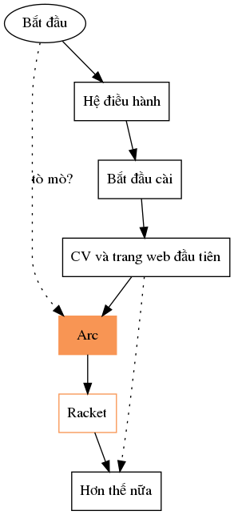

# PHỔ CẬP TIN HỌC 

## Giới thiệu

Giáo trình **Phổ cập tin học** hướng tới đối tượng người đọc là người chưa lập trình bao giờ, và người nghĩ rằng lập trình là thứ xa lạ. Mục đích của cuốn sách này là đi tìm con đường ngắn nhất cho người tò mò đi từ chưa biết gì đến mức có khả năng tạo ra một dự án web cho cá nhân.

Những nội dung tôi tổng hợp ở đây người đọc có thể đến nguồn để tự đọc. Thực ra là sau khi đọc xong ở đây nên đến tận nguồn để tự đọc và tìm thêm các nguồn khác nữa. Tôi trích hết nguồn ở bên dưới, và khi nói đến phần nào liên quan tôi sẽ trích lại nguồn. Những gì tôi nói chỉ là để hiểu rõ hơn, dễ đọc hơn và thêm kinh nghiệm cá nhân. Đây là sản phẩm đại chúng, không có bản quyền ([CC0](https://creativecommons.org/share-your-work/public-domain/cc0/)), ai vào cũng có thể góp ý và sửa đổi và tự thêm các chương khác ở [github của dự án này](https://github.com/ayaderaghul/phocaptinhoc). 

Nội dung chính của giáo trình này là giới thiệu ngôn ngữ lập trình Arc, phát triển bởi Paul Graham. Đây là ngôn ngữ mang tính trừu tượng cao, rất gần với tư duy tiếng Anh và tư duy toán. Nếu bạn nghĩ rằng ngôn ngữ lập trình là thứ gì đó về nhị phân thì bạn đang nghĩ đến ngôn ngữ tầm thấp. Tất nhiên tôi sẽ bàn đến cả ngôn ngữ tầm thấp nữa, nhưng tất cả cuốn giáo trình này là vì Arc.

Bản đồ của cuốn sách này như sau:




Từ vị trí bắt đầu (tức là trang này), người đọc tò mò có thể mở ra đọc trước chương tôi giới thiệu Arc bằng tiếng việt ở [đây](arc.html). Văn bản viết về Arc tự thân nó đứng độc lập như một văn bản triết học vậy. Đọc cho vui đầu. Sau đó nhớ quay lại điểm bắt đầu này :) Bởi vì mục đích của giáo trình này là để xây dựng một môi trường lập trình, trong chương 1 tôi sẽ mô tả chuỗi sự kiện từ lúc bạn nhấn nút bật máy thì hệ điều hành tỉnh dậy và nhập vào với phần cứng mà nó dò được như nào, sau đó hắn quản lý các chương trình và bộ nhớ ra sao, thông tin được lưu trên máy như nào và ta nói chuyện với cái máy ra sao, phần cuối là về mạng internet. Với hiểu biết ban đầu đó, sang chương 2 tôi sẽ viết chi tiết những bước như: Làm thế nào để tìm kiếm thông tin và sự giúp đỡ trên mạng, Cài những phần mềm gì.. Tôi sẽ mô tả hành vi của mình khi tương tác với các phần mềm và máy tính ra sao, trong phần này, tương tác với máy tính nghĩa là mở một cổng nói chuyện với cái máy (*terminal*) và gõ vào dòng lệnh (*command line*) sau đó đợi nó trả lời. Để độc giả khỏi sốt ruột tôi sẽ hướng dẫn cách tạo ra sản phẩm đầu tiên: CV của bạn và một trang web đơn giản, mục này giúp độc giả làm quen với phần mềm biên tập văn bản (*text editor*) Emacs, ngôn ngữ làm đẹp cho văn bản thuần (*markup language*) Markdown và phần mềm ```pandoc``` chuyên dùng để xuất văn bản đó ra các dạng khác nhau như pdf hay html, sau đó tôi sẽ hướng dẫn cách đăng trang web lên mạng trên trang làm việc cộng đồng Github. Sau đó tôi nói về Arc, bởi vì không thể trì hoãn thêm nữa, đáng ra tôi sẽ đặt Arc vào chương đầu tiên, tuy nhiên, đối với người coi lập trình là thứ xa lạ, tôi cần phải đưa cho các bạn một sản phẩm nào đó (ở đây là CV và trang web đầu tiên) mà các bạn nghĩ rằng liên quan đến đời sống của các bạn nhiều hơn *lập trình*. Quan trọng hơn, tôi nhắc lại mục đích của cuốn sách này là tạo ra một môi trường lập trình, cho nên những chương ban đầu dẫn đến Arc đó, sẽ giúp bạn đầu tiên là hiểu được cách mà cái máy vận hành, chứ không chỉ chịu chết bảo rằng đó là ma thuật, sau đó tôi sẽ giúp bạn từng bước thiết lập các thói quen, phần mềm cần thiết để sau đó, ở cuối sách, các bạn có thể lập trình và kiến tạo hiệu quả nhất có thể.

Tất nhiên những chương đầu trước khi dẫn đến Arc, nếu các bạn có những độ làm quen nhất định với máy tính và Linux rồi thì có thể lướt nhanh qua. Nếu không, tôi thật tình khuyến khích mọi người:

* đọc và làm theo thứ tự từ trên xuống,
* bám sát nhất có thể những gì tôi nói về mặt kỹ thuật trước khi đi tiếp. 

<p class="tip"> Mẹo: Có thể làm ào ào qua sau đó quay lại làm kỹ, rồi quay lại lần 3 để kỹ nữa. Khi bị bí có thể đi tiếp một đoạn tới xem nó thế nào, nhưng hôm sau quay lại tìm cách. Tìm cách có thể là lên mạng tìm \(tôi có hướng dẫn tìm trên mạng ở ngay chương 1\), có thể là vào diễn đàn để hỏi và chờ trả lời, hoặc có thể tìm các nhóm hỗ trợ ở địa phương. Hỏi tôi cũng được.

Chương về Arc và Racket giống như một chương độc lập về cách tư duy logic và thiết kế có hệ thống (*liberal art*) và chương đó sẽ là chương quan trọng nhất trong cuốn sách này. Sau khi có tư duy đúng đắn và công cụ năng suất cao, lẽ tự nhiên là tôi sẽ đưa cho các bạn một ví dụ cụ thể (*case study*) về cách tạo ra một dự án sáng tạo cá nhân như thế nào. Và không có ví dụ nào tốt hơn là tôi nói về chính tôi tạo ra cuốn sách này, sử dụng đúng những công cụ mà tôi bảo các bạn và sử dụng chính tư duy logic mà tôi chỉ cho các bạn, cũng như kể lể tôi đã gặp những khó khăn như thế nào để các bạn thấy rằng, ngay cả tôi khi bắt đầu làm dự án này cũng hoàn tòan không lường trước được con đường phía trước có những gì.

Sau khi đã mài sắc công cụ và mài sắc tư duy, các bạn có khả năng tự đánh giá, và có khả năng chỉnh sửa và đóng góp vào chính dự án này. Đây là dự án cộng đồng, đăng trên github, tôi không giữ bản quyền, tất cả đóng góp đều được ghi nhận. Hoặc các bạn có thể bắt đầu làm luôn dự án của chính mình.

## Mục lục
0. Giới thiệu 
1. [Hệ điều hành](he-dieu-hanh.md)
   * Hệ điều hành mã nguồn mở.
   * Mã hóa thông tin 
   * Cách nói chuyện với máy tính 
   * Mạng internet 
2. Bắt đầu cài 
   * Cách tìm thông tin trên mạng 
   * Cài Ubuntu
   * Chuẩn bị Terminal, Emacs, Racket.  
3. CV và trang web đầu tiên 
   * Học Markdown
   * Dùng trang Github 
4. Arc 
5. Tôi đã tạo ra cuốn sách này như thế nào?
6. .. 


## Nguồn & Đọc thêm
* [Arc](http://www.arclanguage.org/tut.txt)
* [How to Design Programs, ed 2](https://htdp.org/2018-01-06/Book/)
* [The Linux Documentation Project](http://www.tldp.org/)
* [Chapter 7: Computer memory](http://statmath.wu.ac.at/courses/data-analysis/itdtHTML/node55.html)
* [Learn Enough Tutorials](https://www.learnenough.com/)
* [W3Schools](https://www.w3schools.com/)
* [The Art of Unix Programming](http://www.catb.org/~esr/writings/taoup/html/index.html)

## Disclaimer

Đây là kinh nghiệm cá nhân của tôi, với mục đích chia sẻ khiến mọi người hiểu rõ hơn về trường hợp của từng người. Mọi người sẽ phải tự tìm con đường đúng nhất cho mình.

This is an attempt to bring better technology to my rural hometown. The sources are listed above. I declare this project to be in public domain under [CC0](https://creativecommons.org/share-your-work/public-domain/cc0/). You are welcome to edit and improve the code on [my github](https://github.com/ayaderaghul/phocaptinhoc). It should also be noted that this book describes my own experience, with the hope to help people. I do not hold any copyrights and I disclaim any responsibility.

All the screenshots was taken by me on my own device. In chapter 2, I use some general images from the internet to illustrate hardware pieces (for example, processor, case, bus, dns workflow..). It helps the reader because they don't have to vaguely imagine complicated stuff (which is the case because the computer is a complicated machine). I put the link to the images right below the images. If someone notices something wrong, please notice me, I would try to resolve right away.


## Acknowledgement

These people significantly change the course of my life for the better: Romas Vijeikis, Hoàng Minh Thắng, Mathias Felleisen. There are some others that I look up and try to learn from them too. I read Paul Graham extensively.

Maintainer: Nguyễn Linh Chi (nguyenlinhchi09@gmail.com)

Alpha testers: Nguyễn Diệu Thu, Trần Đình Khánh, Đào Như Quỳnh, Nguyễn Mai Phương.
