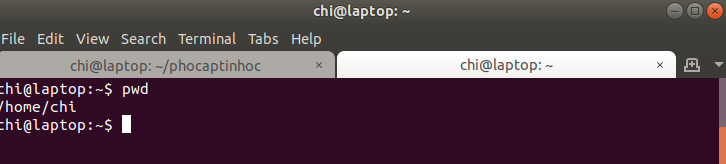

Sau khi có được hiểu biết căn bản về máy tính và hệ điều hành Linux và mạng internet trong chương trước rồi, chương này tôi sẽ nói về cách cài đặt máy tính để tạo ra một môi trường lập trình hoàn chỉnh và năng suất cao. Chương này cần rất nhiều hành động, tôi sẽ cố gắng mô tả chi tiết những hành động này, tôn chỉ và cách tự vận hành để người đọc có thể làm theo sát nhất có thể. Tôi sẽ đưa ra hướng dẫn từng bước, chụp màn hình lại để bạn thấy được kết quả mong muốn trông như thế nào, và cách nghĩ đúng đắn để khi bị bí các bạn có thể vượt qua. Lưu ý không có một cuốn sách hướng dẫn nào có thể đưa ra chi tiết cho tất cả mọi tình huống có thể xảy ra. Chính vì thế tôi viết hẳn một phần về làm thế nào để tự tìm sự giúp đỡ trên mạng. Chính tôi cũng phải tập thói quen này và đây là những thói quen căn bản nhất mà một người lập trình và thiết kế phải phát triển thành bản năng. Thậm chí tôi vừa viết vừa cập nhật bởi vì trong quá trình làm dự án này tôi sinh ra các kiểu nghĩ mới để đối mặt với những khó khăn tự dưng xuất hiện. Đấy cũng là điều bình thường. Các bạn yên tâm là sau chương này, các bạn có thể bắt đầu tạo ra sản phẩm ở ngay chương sau. Chính vì thế tôi cố nhồi hết tất cả các chi tiết lặt vặt về cài đặt và thói quen cách nghĩ ban đầu vào chương này. Tôi muốn các bạn có tư duy hệ thống ngay từ đầu, kể cả chỉ là để tạo ra một cái CV ở chương sau. Các bạn phải tin tôi :)

## Hỏi mạng<a name="hỏi-mạng">

**Bước 1**  Mở trình duyệt [Firefox](https://www.mozilla.org/en-US/firefox/new/). Tại sao không phải Chrome? Thực ra không riêng Chrome mà tôi hạn chế dùng Google. Lý do nói ở bước 2.

**Bước 2**  Gõ trực tiếp vào thanh địa chỉ để tìm kiếm. 

* Thường thì trình duyệt sẽ dùng các bộ máy tìm kiếm sẵn có. Nếu đang dùng bộ máy tìm kiếm Google thay vì [Duckduckgo](https://duckduckgo.com/) thì nhiệm vụ đầu tiên là tìm kiếm cách sử dụng Duckduckgo thay cho Google


* Sau khi dùng Duckduckgo lần đầu thì Duckduckgo sẽ tự hỏi bạn có muốn dùng Duckduckgo hẳn không. Có. Sau khi cài đặt trên máy tính thì làm tương tự để có Duckduckgo trên điện thoại.

* Tại sao dùng Duckduckgo? Google đơn giản là quá mạnh và quá quyền lực, thế giới không hại gì nếu có thêm chút cạnh tranh, chất lượng sẽ tốt hơn và người dùng không bị chèn.


<p class="warning"> Khi lên mạng và nghe có người đưa ra một thông tin mang tính chính trị như thế này. Cần phải tự tìm hiểu ở các nguồn khác. Ví dụ, tôi vào mạng và gõ: is google evil? đây là [câu trả lời ở trang Quora](https://www.quora.com/Is-Google-an-evil-company). Câu trả lời chi tiết và không phải là quá đáng nghi. Đây nữa: Hàng trăm nhân viên Google ký đơn phản đối Google hợp tác với nhà nước Trung Quốc để tạo ra một phiên bản google bị nhà nước kiểm soát, [link](https://medium.com/@googlersagainstdragonfly/we-are-google-employees-google-must-drop-dragonfly-4c8a30c5e5eb).

<p class="note"> Nếu thấy muốn hạn chế dùng Google thì vào trang [nomoregoogle](https://nomoregoogle.com/) để tìm các sản phẩm thay thế.


<p class="tip"> Một trang nữa để thi thoảng xem cho vui đấy là [Reddit](https://reddit.com). Thông tin trên này không phải là đúng hoàn toàn, nhưng ít ra không phải thuộc nhà nước hay các tập đoàn lớn. Tập đoàn càng lớn, sự kiểm soát truyền thông càng chặt thì thông tin càng một chiều và dễ bưng bít.

 
* Tôi nói tiếp. Từ sau lần đầu tiên đó, mỗi lần mở Firefox để gõ trực tiếp vào thanh địa chỉ để tìm kiếm thì  bộ máy tìm kiếm sẽ là Duckduckgo.

**Bước 3** Sau khi gõ trực tiếp vào thanh địa chỉ tìm kiếm, nhấn Enter. Sẽ có vô vàn kết quả hiện ra. 


<p class="tip"> Kết quả đầu tiên dễ là quảng cáo. Tôi không thích ấn vào link quảng cáo. Link quảng cáo có chữ AD ở bên cạnh. Thường thì kéo xuống sẽ có link thường không phải quảng cáo.


**Bước 4** Chọn lấy 2-3 kết quả đầu tiên hoặc đọc lướt tiêu đề thấy có vẻ phù hợp 
	
* Mở các kết quả này sang tab mới bằng chuột giữa hoặc ```Ctrl + Click``` để mở một phát 3 kết quả không bị nhảy tab mới tự động 
* Khi hỏi về code thì các trang như stackoverflow hoặc các trang hỗ trợ chính thống của chương trình đó \(ubuntu, mozilla network..\) sẽ có câu trả lời tốt nhất. 
* Khi hỏi về cách làm gì đó thì wikihow hay có từng bước hướng dẫn kèm hình ảnh. 
* Khi hỏi về các sự kiện thì wikipedia sẽ là chỗ đầu tiên tôi tìm đến. 
* Một số sự kiện chính trị hoặc cool ngầu thì tôi gõ thêm reddit vào cuối để hiện các mục tranh luận về sự kiện đó trên reddit.

**Bước 5** Tìm cách làm theo hướng dẫn ở trong các link đó.

**Bước 6** Nếu không được, tìm cách đăng câu hỏi lên những diễn đàn đó hoặc mai tìm lại


**Bước 7** Vẫn không được thì đi hỏi trợ giúp tại địa phương

## Cách đặt tên tập tin

* Đặt tên đúng trọng tâm, ví dụ: todo.txt, banana.png, test.md, he-dieu-hanh.html
* Không đặt tên lù mù như tên facebook của một số thanh niên

## Dùng phím tắt

Sau khi biết cách tìm kiếm trên mạng, lên mạng tìm cách sử dụng phím tắt cho từng phần mềm. Mỗi khi mở phần mềm nào ra, cố gắng sử dụng các phím tắt nhiều lần để tạo thành kết nối nơ-ron trong não, các lần sau sẽ nhanh hơn.

## Firefox<a name="firefox">

| Phím tắt | Công dụng  |
| :--- | :--- |
| ```Ctrl + T``` | Mở tab mới  |
| ```Ctrl + W```| Đóng tab |
| ```Alt + 1```| Chuyển sang tab 1 |
|```Alt + 2```| Chuyển sang tab 2 |
| ```Alt + <-```| Quay lại trang trước |
| ```Alt + ->``` | Ngược lại của quay lại trang trước |
| ```Home``` | Lên đầu trang |
| ```End```| Xuống cuối trang |
| ```Pg Up```| Kéo lên nhanh hơn mũi tên lên và chậm hơn cuộn |
| ```Pg Dn```| Kéo xuống |

Muốn biết phím tắt cho việc gì thì vào Duckduckgo gõ. Ví dụ: hot keys for switching keyboard layout. 

* Dùng chuột để túm vào đầu trang và kéo thả, nháy đúp vào đầu trang để mở toàn màn hình và nháy đúp lại để thu nhỏ lại cỡ trước đó.

* Thứ nữa, khi dùng Firefox cần có thank Bookmarks, tức là thanh mà lưu lại những trang hay ho. Lưu lại bằng cách chỉ con trỏ chuột vào icon bên cạnh khung ```https://example.com``` sau đó kéo xuống thanh Bookmarks và thả vào thanh. Thường thì nên ấn chuột phải vào thanh để tạo thư mục cho các loại trang mình muốn lưu lại. Ví dụ thư mục chuyên để lưu những trang giải trí, thư mục chuyên để lưu những trang học toán.. Khi muốn thay đổi vị trí những link này có thể kéo thả.


* Khi gõ vào tên trang web mình hay vào, máy sẽ tự động điền nốt, chỉ cần ```Enter``` hoặc dùng mũi tên lên xuống để chọn site đã lưu rồi ```Enter```.

## Ubuntu

Tôi sẽ không đi sâu vào vấn đề này. Bởi vì trợ giúp cài đặt [Ubuntu](https://www.ubuntu.com/download/desktop) thì đi tìm nhóm Linux mã nguồn mở ở địa phương là tốt nhất. Hoặc tự đọc trên mạng. Hoặc nếu ai đóng góp viết giùm được đoạn này thì càng tốt.

* Mở trình duyệt Firefox để vào mạng
* Gõ vào Duckduckgo: làm thế nào để cài ubuntu / how to install ubuntu. Chọn xem một vài kết quả ban đầu xem trang hướng dẫn nào có vẻ dễ hiểu. Ví dụ trang wikihow hay có ảnh và viết thành từng bước
* Tôi nhớ láng máng là dùng CD hoặc không thì tải Ubuntu vào USB rồi tự boot lên và làm theo chỉ dẫn trên màn hình.
*  Tìm các trang hướng dẫn bằng tiếng việt, nhóm hỗ trợ Linux ở địa phương

## Dùng phím tắt và cài thêm các phần mềm hoa lá cành

**Lên mạng tìm kiếm:**
* Cách chuyển đổi giữa các màn hình của Ubuntu dùng phím tắt. Ubuntu có 4 màn hình.
* Cách tìm chương trình mình cần (ví dụ Firefox, Terminal) và ghim chương trình đó vào thanh công cụ ở màn hình để cho dễ lần sau 


* Cách cài các chương trình mình cần mà trong máy chưa có. Ví dụ bộ gõ tiếng việt.

**Ra khỏi mạng đi tìm:**
* Một cái màn hình bỏ, cắm luôn vào lap để thành 2 màn hình. Màn hình máy tính để gõ code và màn hình kia để nhìn thấy trang web mình làm thay đổi ngay lập tức. Tôi có luôn một cái thảm tập ở ngay cạnh. Tôi không biết *man cave* (hang động của bọn con trai) như nào, nhưng hang động của tôi khá là *zen* :D 


Tôi sử dụng nhiều nhất các phần mềm sau, và tôi sẽ đi sâu vào những phần mềm này. Vì tất cả các yếu tố gộp lại thành một môi trường lập trình tương tác và lặp đi lặp lại quá trình nhào nặn sản phẩm sáng tạo cực kỳ nhanh. Các bạn cần cài và ghim hết đám này ra thanh công cụ ở màn hình.


Tôi sẽ chụp màn hình những phần mềm trên từ trên xuống cho các bạn xem:
* Todo list, tôi toàn viết các mảnh code tôi hay dùng vào đó. Ví dụ một dòng lệnh để xuất ảnh từ phần mềm vẽ biểu đồ, hay một dòng lệnh để xuất pdf từ md bằng ```pandoc```. Chỉ có một dòng nên lần nào cũng tìm trên mạng nó mất công.


* Terminal, đây là cổng giao tiếp với máy tính. Gọi ra bằng tổ hợp ```Ctrl + Shift+ T```. Tôi sẽ gõ những dòng lệnh mà tôi muốn cái máy làm vào cổng này, cái máy tính sẽ nghe, xử lý tập tin theo ý tôi. Bạn có thể mở thêm tab mới bằng tổ hợp phím ```Ctrl + Shift + T```. Tôi đang mở tab mới vì tab đầu tôi để chạy server tại máy cho chính cuốn sách này. Tôi muốn nhìn thấy thay đổi ngay khi tôi gõ.


* Emacs, đây là phầm mềm biên tập văn bản (*text editor*), hiện tôi đang gõ chính phần nội dung trong sách này nên khi tôi chụp lại các bạn có thể thấy được điều đó.


* Firefox, đây là phần mềm để vào mạng (*browser*). Các bạn có thể thấy tôi đang đăng thử trang sách tôi đang viết đây tại máy tính của tôi (*localhost*).


* Racket, đây là phần mềm DrRacket, dùng để học ngôn ngữ lập trình Arc và Racket mà tôi sẽ nói ở các chương sau. Bạn nhất định phải cài, ở [đây](https://download.racket-lang.org/).


* Clipboard, là phần mềm lưu lại các nội dung copy. Bởi vì hắn có thể lưu những nội dung copy từ lần trước trước cả trước nữa nên đôi khi có ích, cứ để phòng thân. Ví dụ khi bạn bôi đen một đoạn văn bản và ấn phím xóa, văn bản đó mất, nhưng nếu bạn ấn tổ hợp để cắt đoạn đó đi, thì Clipboard lưu lại và về sau bạn có thể dán lại.
* Ngoài ra các bạn cần tìm để cài thêm TEX và ```pandoc```, là những phần mềm dùng để xử lý và xuất văn bản rất đẹp và phổ biến. Những cái tiểu tiết này tôi đi sâu vào mất thời gian, bởi vì mỗi hệ thống khác nhau. Thật tình là các bạn kiếm trên mạng hoặc sự giúp đỡ địa phương thì nhanh hơn. Và tôi có thời gian viết cái chính.

Lưu ý, những phần mềm sau các bạn nhất định phải tìm cách cài và sử dụng: Terminal, Emacs, Racket. Tôi sẽ mô tả chi tiết cách tôi dùng nhưng các bạn cần tự tìm hiểu thêm.

**Điện thoại**
Nhân tiện tôi nói về điện thoại: Khi có internet trong tay, tôi vào mạng check mail, đọc tin, xem video. Trên điện thoại, tôi dùng những phần mềm sau:

* Google Calendar để sắp lịch
* Duckduckgo để tìm kiếm và vào mạng
* Signal để nhắn tin
* Money Lover để ghi chép tiền bạc
* Google Maps để xem đường
* My Calendar và Hormone Horoscope \(tùy\) để theo dõi kỳ kinh nguyệt
* Email tutanota 
* Email gmail
* QuickMemo để ghi chú nhanh
* Youtube để xem video
* Lite \(Messenger để gọi điện về nhà\)

## Terminal<a name="terminal">

Source: [Learn Enough Command Line to Be Dangerous](https://www.learnenough.com/command-line-tutorial) & [Bash Programming - Introduction How-to](http://www.tldp.org/HOWTO/Bash-Prog-Intro-HOWTO.html)

Tôi bắt đầu chỉ cách dùng các phần mềm, bắt đầu từ cổng giao tiếp Terminal. Terminal là cổng để người dùng nói chuyện với cái máy tính. Nói thế nào? Tôi gõ vào dòng lệnh (*command line*) và cái máy sẽ xử lý loạn lên sau đó trả về một đống thông tin ở cổng đó. Nói nôm na có nhiều từ dùng để chỉ phần mềm ở cổng này, *shell*, *bash*, dòng lệnh gọi là *command line*, *script*.. Tôi chỉ biết *bash* nghĩa là *Bourne Again Shell* vì hồi trước ông Bourne làm Bourne Shell cho nên hồi sau họ trêu gọi là Born Again Shell (Shell hồi sinh). Và họ gọi là **shell** bởi vì **shell** bọc lấy **kernel** (shell là vỏ và kernel là lõi). Nói chung giới lập trình có nhiều cái kỳ quặc. Họ hay ghép chữ và hay chơi chữ kỳ quặc. Cư xử cũng như máy. Người không quen thấy kỳ. Quen rồi ..meh.. 

Dùng phím tắt ```Ctrl + Alt + T``` để gọi Terminal ra. Tôi sẽ vừa chụp màn hình vừa viết lại code hiện ra trong ảnh, phòng khi không tải được ảnh, các bạn vẫn nhìn thấy nó như thế nào. Trong ảnh, terminal của tôi có 2 tabs, do 1 tab tôi chạy server tại máy cho quyển sách này, phím tắt để mở tab mới là ```Ctrl + Shift + T```.

Khi mới mở terminal ra, sẽ có một mớ chữ ban đầu, đại để của tôi là 


```
chi@laptop:~$
```

Cái này nghĩa là đang đợi lệnh bạn gõ vào. Bảo gì làm nấy. Gõ lệnh đầu tiên: ```pwd``` sau đó ấn ```Enter```




```
chi@laptop:~$ pwd 
/home/chi 
chi@laptop:~$
```
Bạn sẽ thấy là cái cổng in ra dòng chữ ```/home/chi``` sau đó xuống dòng mới, đợi lệnh mới. Vậy lệnh ```pwd``` là lệnh gì? Đó là lệnh hỏi xem vị trí hiện tại tôi đang ở đâu trong cây thư mục của toàn hệ thống. Toàn hệ thống là một cây thư mục có rất nhiều cành nhánh, tôi đang ở khá gần gốc, thường gọi là thư mục chủ nhà (*home directory*). Dấu ngã ```~``` thường để chỉ thư mục chủ này. Chủ ở đây là chủ người dùng, không phải gốc là *root*. *root* là /. Cụm ```chi@laptop:~$``` có nghĩa là người dùng ```chi``` đang ở thiết bị ```laptop``` và ở thư mực ```~``` (nghĩa là thư mục chủ) của thiết bị này.


#### Ctrl + C

Bây giờ, nhỡ gõ vào lệnh nào đang gõ dở hoặc lệnh lạ trót ```Enter``` xuống dòng xong nó bị dắt thì sao, làm nào? Gõ ```Ctrl + C```. Tôi không biết tại sao nhưng ```Ctrl+C``` là chuẩn thoát ra của rất nhiều thứ. Cứ bị mắc cái gì không biết thoát thế nào là thử ```Ctrl+C```. Sau đó đến ```Esc```, sau đó có thể là thử gõ các thể loại khác nhau của ```quit Enter```, ```exit Enter```.. Cùng đường thì ấn dấu ```x``` để thoát.

Ví dụ: gõ ```tail Enter``` thì bash sẽ đợi mãi không thôi. Bắt buộc phải ```Ctrl + C``` mới thoát được.


```
chi@laptop:~$ tail 
^C
chi@laptop:~$ 
```

#### mkdir 

```mkdir``` nghĩa là make directory (tạo thư mục mới). Làm thế này để cây thư mục có thêm nhiều cành nhánh. Ví dụ từ thư mục chủ tôi muốn tạo ra một thư mục mới tên là CV, để sau này tôi viết CV đợi việc thì bỏ vào đó. 


```
chi@laptop:~$ mkdir CV
chi@laptop:~$
```


#### ls

Sau khi tạo xong ta không biết là nó có tạo ra thật chưa. Cần phải có lệnh để liệt kê các thứ ở trong thư mục ta đang đứng để xem nó có những cái gì. Đây có lẽ là lệnh được dùng nhiều nhất. ```ls```


```
chi@laptop:~$ ls
CV
chi@laptop:~$
```
Thường trong thư mục chủ của bạn sẽ có nhiều thứ hơn, nhưng ở đây tôi giả định chỉ có thư mục CV ta vừa tạo. Sau khi tạo xong thư mục CV ta lại muốn nhảy vào thư mục đó để bắt đầu viết CV.

#### cd 

```cd``` nghĩa là change directory (thay đổi thư mục). Ta dùng lệnh này để đi từ nốt này đến nốt khác của cây thư mục.


```
chi@laptop:~$ cd CV
chi@laptop:~/CV/$
```
Khi ta nhảy vào thư mục ```CV``` ta thấy rằng cụm chữ ở đầu dòng lệnh đã thay đổi, hắn hiện ra thêm tên của thư mục CV.


```
chi@laptop:~/CV/$ pwd 
/home/chi/CV
chi@laptop:~/CV/$ ls 
chi@laptop:~$
```
Khi ta ```pwd``` thì máy sẽ trả về địa chỉ thư mục ta đang đứng: ```/home/chi/CV``` và khi ta ```ls``` máy sẽ không trả về gì cả bởi vì ta chưa có gì trong thư mục này cả.

#### Open in Terminal 

Vào mạng tìm cách cài Open in Terminal. Sau khi cài xong, chỉ cần vào thư mục bất kỳ và ấn chuột phải, chọn Open in Terminal thì cổng Terminal sẽ mở ra ở đúng địa chỉ thư mục đó. Nhiều khi thư mục ta cần ở quá sâu trong cây thư mục, nếu gõ ```cd``` thì địa chỉ rất dài và tôi rất mệt.

#### touch 

```touch``` là lệnh để tạo tập tin trắng. Ví dụ tôi tạo một tệp trắng tên là CV.md để sau tôi viết vào đó. Tôi để đuôi là .md để khi tôi mở tập tin này bằng phần mềm chỉnh sửa văn bản thuần Emacs, Emacs biết ngôn ngữ là Markdown, Emacs sẽ hiển thị màu cho code. Nếu bạn không để đuôi cũng không sao cả. Ta bật chế độ Markdown trong Emacs sau cũng được.


```
chi@laptop:~/CV/$ touch CV.md 
chi@laptop:~/CV/$ ls
CV.md 

```

#### rm 

```rm``` là lệnh để xóa tập tin và thư mục.


```
chi@laptop:~/CV/$ rm CV.md 
chi@laptop:~/CV/$ ls
chi@laptop:~/CV/$ touch CV.md 
chi@laptop:~/CV/$ ls
CV.md 

```

#### Cheatsheet 

Ngoài ra các bạn có thể tìm thêm command line tutorials, command line cheatsheet, bash command lines.. sẽ có rất nhiều trang viết về các lệnh thông dụng. Bạn chọn trang nào dễ đọc nhất thì lưu lại. Ồ tôi quên, vào [Learn Enough Command Line to be Dangerous](https://www.learnenough.com/command-line-tutorial) là dễ nhất. Có đầy đủ hình ảnh, ví dụ và đi từ dễ đến vừa đủ. Nếu các bạn không học theo trang đó ngay bây giờ thì nên dành thời gian để tuần sau học trang đó. Tôi nói thật.
