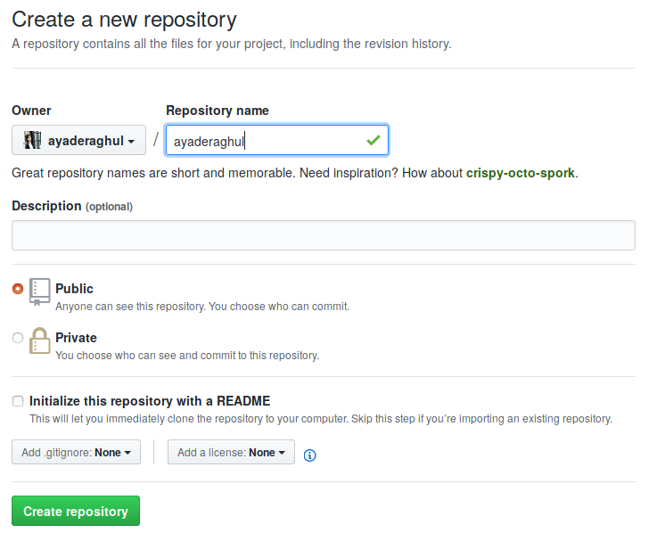

Trong chương này tôi sẽ hướng dẫn cách tạo văn bản đẹp bằng ngôn ngữ *đánh phấn cho văn bản* tên là ngôn ngữ Markdown, sau đó xuất ra HTML và đăng lên mạng trang web đầu tiên của bạn trên Github. Github là trang làm việc cộng đồng cho người lập trình.

## CV
Nếu chưa ghim Emacs vào thanh công cụ ngoài màn hình thì tìm chương trình Emacs trong máy, (chưa cài thì tìm cách cài), sau đó ấn chuột phải vào biểu tượng Emacs trên thanh công cụ để chọn ```Add to Favorites```, khi đó Emacs sẽ được ghim sẵn vào thanh công cụ mỗi lần mở máy. 

Bây giờ ta học cách mở Emacs ra và bắt đầu viết CV. Markdown không phải ngôn ngữ lập trình mà là ngôn ngữ đánh phấn cho văn bản. Tức là ta gõ vào chữ không thôi sau đó dùng Markdown để tô vẽ thành văn bản đẹp. Emacs ở đây gọi là *text editor* tức là phần mềm biên tập văn bản. Có thể mở tập tin bằng Emacs với 2 cách:

#### Mở tập tin bằng Emacs
- Vào thư mục chứa tập tin, ấn chuột phải vào tập tin và chọn ```Open with Emacs```. Khi đó màn hình hiện ra như sau: 


Bạn có thể thấy là khung viết rất hẹp và có hẳn khung quảng cáo ở dưới. Để đóng khung đó lại, ấn tổ hợp phím ```Ctrl + x``` nhả ra 1s rồi ấn tiếp phím ```1```. Khi đó khung viết sẽ dàn đầy ra.


- Cách 2: ghim sẵn Emacs ở thanh công cụ, mở Emacs ra và bảo đường dẫn của tập tin cho Emacs biết, Emacs sẽ tự tất tả đi tìm.

Khi ta mở emacs ra ta sẽ thấy có màn hình chờ xanh đỏ: 


Các bạn có thể thấy ở dưới cuối của Emacs, ngoài vùng để gõ văn bản vào còn có khung hẹp. Khung hẹp đó để gõ lệnh vào sai khiến Emacs: 


Bây giờ tôi sẽ chỉ cách đọc lệnh của Emacs và cách bấm theo tổ hợp phím đó. Để sau này bạn đi tìm trên mạng hoặc đọc trong hướng dẫn của Emacs có thể hiểu được. Ví dụ lệnh tìm tập tin sẽ được viết là ```C-x C-f```. Chữ C nghĩa là phím Ctrl. Lệnh này thao tác như sau: Nhấn phím ```Ctrl``` và ```x``` cùng lúc, sau đó nhả ra 1s và nhấn tiếp 2 phím ```Ctrl``` và ```f``` cùng lúc. 

Khi ta gõ xong sẽ thấy ở khung hẹp dưới đó hiện ra ```Find file: ~``` nghĩa là Emacs đang đợi ta gõ vào đường dẫn của tập tin, bắt đầu từ thư mục chủ. 


Ở đây, tập tin CV nằm ở thư mục CV ngay thư mục chủ nên ta chỉ việc gõ tiếp ```CV/CV.md RET```. ```Enter``` ở Emacs gọi là ```RET``` (*return*) do lịch sử. 


Sau khi bạn Enter thì Emacs mở tập tin ra. Do đây là tập tin trắng nên màn hình trắng toát, đợi ta gõ vào.


Khi bạn đi tìm lệnh và phím tắt của Emacs trên mạng cần biết thế, cùng với ```Alt``` họ gọi là ```M``` nữa. Nếu đang không muốn gõ lệnh mà tự dưng dây vào cái khung hẹp ở dưới đó và Emacs cứ đợi mãi không thôi thì có 2 cách thoát ra: ```C-g``` (Quit) và ```Esc Esc Esc``` (nhấn ```Esc``` 3 lần). Không thì nhấn chuột vào dấu ```x``` thoát ra vào lại.

#### Viết CV với Markdown<a name="viết-cv-với-markdown">
Xong phần mở tập tin, giờ ta bắt đầu viết vào trang trắng của tập tin CV mà Emacs vừa mở. Tôi muốn tiêu đề của văn bản này là tên của tôi chả hạn, và tôi muốn kiểu tiêu đề to nhất. Nếu tôi chỉ gõ vào tên của tôi không thôi thì khi ra văn bản sẽ chỉ là font chữ bình thường chứ không phải tiêu đề. Để máy tính hiểu được rằng tôi muốn tiêu đề thật lớn, tôi cần gõ vào một dấu hiệu để đánh dấu (vì thế mà Markdown, HTML, Tex được gọi là *markup language*. Markdown là chơi chữ của chữ *markup*. Dân công nghệ họ vậy biết sao được). Tiếp tục, tín hiệu của tiêu đề to nhất h1 (*header 1*) trong Mardown là dấu thăng #. Vì thế tôi gõ vào:

```
# Trần Thị Mai 
```


Nếu bạn không đặt tên tập tin có đuôi là .md thì giờ ta bật chế độ markdown trong Emacs lên bằng lệnh ```M-x markdown-mode RET```. Cách thao tác tổ hợp phím lệnh này như sau: ```M-x``` nghĩa là ```Alt-x```, bạn nhấn cùng lúc Alt và x sau đó gõ dấu cách rồi gõ vào markdown-mode và Enter. Thường tôi không nhớ những lệnh này, tôi gõ vào markdown và nhấn tab để Emacs điền nốt. Nếu có nhiều hơn một lệnh thì Emacs hiển thị cho tôi xem để chọn.


Nếu bạn không có dòng lệnh đó, thì tức là cần cài thêm gói lệnh đó. Trên thanh menu, chọn Options > Manage Emacs Packages. Một trang mới mở ra, toàn là các gói lệnh khác nhau, trăm hoa đua nở. 


Bạn gõ ```C-s``` sau đó gõ tên lệnh bạn muốn cài thêm để tìm. 


Sau đó nhấn chuột vào gói lệnh bạn muốn cài và làm theo hướng dẫn. Một điều rất quan trọng, đó là toàn bộ cách nghĩ mã nguồn mở rất dễ để đoán và làm theo hướng dẫn. Tôi sẽ không đi sâu vào vấn đề này. 


Ở đây tôi đã cài rồi nên Emacs nói rằng gói này đã được cài và chỉ có nút ```Delete``` đi thôi. Nếu bạn chưa cài sẽ có nút ```Install```. Tôi nhấn mạnh là Emacs có rất nhiều cách để thêm rất nhiều lệnh hay và các chế độ hay. Các bạn cần tùy theo nhu cầu của mình mà tìm cách cài thêm. Hoặc đọc tài liệu của Emacs. 

Quay lại văn bản CV, chế độ Markdown là để Emacs tô màu cho các dòng code cho dễ nhìn hơn. Có một chế độ nữa để xem văn bản cuối cùng nhìn như thế nào Ta cần gõ lệnh bảo Emacs cho xem trước văn bản Markdown này. Dòng lệnh là ```M-x markdown-live-preview-mode RET```. Như đã nói ở trên ```M-x``` nghĩa là ```Alt + x``` 


Sau đó gõ dấu cách và gõ vào dòng lệnh trên. Khi tôi gõ ```markdown-live``` tôi nhấn tab để Emacs tự điền nốt, thay vì dấu ```-``` tôi gõ dấu cách thì Emacs cũng tự hiểu sang dấu gạch. Gõ xong thì ```RET``` (tức là ```Enter```). Sau khi lưu, bạn sẽ thấy Emacs mở ra thêm một cửa sổ để khi bạn gõ văn bản thì Emacs cũng update cho bạn CV của bạn trông như thế nào. Cách lưu văn bản tôi sẽ nói ngay sau đây.


Sau dòng đầu tiên thì ta cần lưu lại, lệnh lưu là ```C-x C-v```: Nhấn ```Ctrl``` và ```x``` cùng lúc sau đó nhả ra 1s và nhấn ```Ctrl``` và ```v``` cùng lúc. Bạn có thể thấy là sau khi bạn lưu thì Emacs tự cập nhật văn bản cho bạn, Emacs có 2 khung. Muốn về 1 khung thôi thì ấn ```C-x 1```.


Sau dòng tên thì tôi xuống dòng viết email của mình, tôi muốn email của mình là font thường thôi nhưng để nghiêng cho đẹp. Ta bọc phần muốn nghiêng vào giữa 2 dấu sao và máy tính sẽ biết để làm nghiêng phần đó. Sau khi gõ email xong bạn lưu lại (```C-x C-v```), Emacs sẽ tự động cập nhật khung dưới cho bạn xem văn bản của bạn trông như nào. Hiển thị markdown của Emacs hơi xấu nhưng đại để vẫn đúng với tinh thần dấu thăng là h1 và dấu sao là in nghiêng. Lát nữa ta xuất tập tin sang pdf bằng pandoc sẽ có văn bản đẹp hơn nhiều, do pandoc chuyển đổi md qua TEX rồi mới qua pdf.

```
# Trần Thị Mai 

*maitran@gmx.com* 
```


Sau phần đầu trang này thì tôi muốn gạch ngang trang để xuống vào phần thân bài. Gạch ngang trang là 3 dấu gạch.

```
# Tran Thi Mai 

*maitran@gmx.com* 

---

```
Sau đó tôi muốn có hai khối văn: một khối cho kinh nghiệm đi học và một khối là kinh nghiệm lập trình. Tiêu đề của khối thì nhỏ hơn tiêu đề của trang, ví dụ ```##``` là h2, ```###``` là h3.

```
# Tran Thi Mai 
*maitran@gmx.com*
---
## Academic background 
My degree is in Game theory and Social Conflict. 

## Programing language 
I code my simulation in Racket (LISP).
I also know HTML, CSS, JS, command line and Git. 
Here is [my github page](https://github.com/tranthimai)
```


Các bạn chú ý tôi vừa chèn link vào CV của mình. Ngữ pháp khá đơn giản, bạn cho cụm từ mà click được vào ngoặc vuông và bọc link vào ngoặc tròn.


Dưới 2 khối văn này tôi kẻ ngang và viết một đoạn văn ngắn về mình.
```
# Tran Thi Mai 
*maitran@gmx.com*
---
### Academic background 
My degree is in Game theory and Social Conflict. 

### Programing language 
I code my simulation in Racket (LISP).
I also know HTML, CSS, JS, command line and Git. 
Here is [my github page](https://github.com/tranthimai)
---
## Cover letter 
Due to my lack of experience, I am willing to take an internship or entry level job.

```


Lưu lại bằng lệnh ```C-x C-s```. Thoát ra bằng lệnh ``` C-x C-c ``` hoặc nhấn chuột vào dấu ```x```. Ngữ pháp Markdown khá đơn giản, chỉ có vậy. Thường tôi cũng chả nhớ hết. Nhưng tôi vào mạng gõ Markdown syntax hoặc markdown cheatsheet và xem 1-2 link. Hoặc tôi bookmark (đánh dấu) trang đó lại vào thanh Bookmark của Firefox, thư mục Tools để xem sau. Ví dụ trong [link này](https://github.com/adam-p/markdown-here/wiki/Markdown-Cheatsheet) vừa viết code cái họ có kết quả cho xem ngay để biết trông như nào.

#### Xuất markdown ra dạng pdf 
Nếu bạn gõ văn bản như CV bằng markdown thì bạn có thể xuất ra pdf. Nếu bạn gõ trang web bằng markdown thì xuất ra dạng html. Tôi gõ nội dung sách này bằng markdown sau đó xuất ra html. Phầm mềm ```pandoc``` là phần mềm xuất markdown ra các dạng khác rất tốt. Nếu các bạn gặp khó khi cài thì cần tìm giúp đỡ, các bạn cần phải tin tôi.

Ví dụ đây là lệnh xuất ra pdf từ Terminal:

```
pandoc -s -o CV.pdf CV.md 
```

Tôi thử xuất CV trên ra thì pandoc báo lỗi, do có ký tự tiếng việt, cần thêm một flag (thêm một ít code nữa) trong dòng lệnh pandoc, tôi thêm vào thì chạy bình thường. Hình dưới đây là CV do tôi viết tiếng Anh và xuất ra đúng bằng dòng lệnh trên, không bị lỗi. Khi tôi mới có rất ít kinh nghiệm làm việc, tôi bắt đầu tìm việc trên mạng kiểu thực tập hay việc cho người mới. Cho nên CV ngắn tủn vậy. Công ty có gửi mail bảo tôi làm bài kiểm tra logic. Tôi không được nhận, nhưng cũng thấy có ích. Đi từ trường học ra cần có chút hiểu biết về quá trình tìm việc và cuộc đời.


## Trang web đầu tiên

Bạn có thể dùng pandoc để xuất thẳng tập tin CV của bạn ra html và sau đó mở tập html đó bằng Firefox bạn sẽ thấy đó là trang web đầu tiên của bạn. Rất nhiều người làm CV trên mạng kiểu này để kiếm việc. Chỉ có vài kỹ năng đó mà tôi viết trang web đầu tiên. Trang web đầu tiên của tôi là trang web có 2 trang con: About me và Posts. Trang About me tôi viết như CV. Còn trang Post là link đến các blog posts mà tôi viết. Hai năm đầu tiên tôi viết blog là thế đó, ở [đây](https://ayaderaghul.github.io). Đơn giản không?

#### Đăng trang web đầu tiên lên mạng 

Để làm điều này bạn cần hiểu về Git và github. Tôi sẽ chỉ cách viết một trang web đơn giản. Tôi không bảo các bạn đăng bản CV của mình vì trong đó có thông tin cá nhân của các bạn. Nhưng nếu các bạn đang tìm việc hoặc như tôi, muốn có trang viết blog online thì có thể làm như các bạn muốn. Xuất tập tin CV.md mà bạn vừa viết ở trên ra HTML bằng ```pandoc``` (cũng chỉ mất một dòng lệnh thôi). Sau khi xuất ra HTML rồi bạn có thể mở tập tin CV.html bằng Firefox. Đây là tập tin của tôi, lưu ý trang này vẫn ở trên máy của bạn chứ chưa lên mạng.


Tốt nhất là tôi cứ giúp bạn đăng thử một trang không chứa thông tin cá nhân. Và lần này viết trực tiếp bằng HTML luôn. Đầu tiên bạn tạo thư mục tên là blog.

```
$ mkdir blog
$ cd blog 
$ touch index.html
```

Các bạn có thể tạo tập tin trắng rồi mở bằng emacs hoặc Mở Emacs > New file. Tức là mở Emacs và mở tập tin trắng. Bảo Emacs rằng tôi đang gõ HTML bằng lệnh sau: ``` M-x web-mode RET``` Lưu ý dòng web-mode mặc dù được nối bằng gạch ngang ```-``` nhưng nếu bạn nhấn ```space``` thì Emacs cũng tự gạch ngang cho bạn. Có một lệnh nữa rất có ích, đó là ```M-x auto-complete-mode RET```, khi bạn gõ HTML thì Emacs tự điền đuôi thẻ và các từ lặp lại cho bạn. Thường thì HTML và CSS lặp lại rất nhiều, gõ mãi cũng chán.

Bạn nên đặt tên tập tin là index.html. Vì lý do lịch sử, trang chính của một trang web luôn luôn có tên này. HTML là Hyper Text Markup Language, tức là ngôn ngữ đánh dấu văn bản. Đây là ngôn ngữ làm web. Khi trình duyệt đọc tập tin bạn viết và thấy rằng đây là tập tin html, hắn sẽ hiển thị văn bản theo sự đánh dấu của bạn. Trong ví dụ CV ở phần trước, các bạn có thể thấy rằng khi bạn đánh dấu là dấu thăng thì sẽ được hiểu là tiêu đề lớn nhất h1. Và các bạn đã luyện tập đánh các dấu khác nhau để cái máy hiểu được đó là những phần bạn muốn biểu thị khác nhau. Markdown là ngôn ngữ đơn giản hơn HTML, nhưng cốt lõi thì cũng như vậy. HTML có nhiều dấu hơn rất nhiều, và các dấu được viết hơi khác. Ví dụ tiêu đề h1 sẽ được bọc trong dấu có cấu trúc như sau:

```
<h1> Kinh chao ba con, </h1>
```
Nếu bạn bật chế độ tự điền trong Emacs, khi bạn gõ đến </ thì Emacs sẽ tự điền nốt dấu đóng cho bạn. Bây giờ nếu bạn lưu lại và mở tập tin index.html của bạn ra bằng trình duyệt Firefox, bạn sẽ thấy trình duyệt hiểu được rằng bạn muốn hiển thị dòng chữ "Kinh chao ba con" như tiêu đề vừa to vừa đậm.


Nếu chỉ có tiêu đề và đoạn văn và in nghiêng in đậm thôi thì chưa đủ. Những đoạn chữ về thông tin meta của văn bản thì sao, hoặc tên trang mà hiện ra trên đầu tab thì sao, hoặc logo bé xíu trên đầu tab thì sao. Đây là khung xương của văn bản html căn bản:

```
<html>
	<head>
		<title> Trang tin </title>
	</head>
	<body>
		<!-- Comment se khong duoc hien thi -->
		<h1> Kinh chao ba con, </h1>
		<p> Chuc toan the ba con suc khoe doi dao. </p>
	</body>
</html>
```

Khi bạn lưu lại và nhấn f5 ở trình duyệt thì sẽ thấy nội dung trang thay đổi. 


Tôi sẽ quay lại hướng dẫn cách làm web cụ thể hơn ở chương sau nữa. Bây giờ với trang web đơn giản này, ta sẽ đăng nó lên mạng. 

#### Git

<p class="note"> Tìm hiểu thêm về Linus Torvald - tác giả của phần mềm Git

Git là một phần mềm viết ra nhằm mục đích khiến cho tất cả mọi người trên khắp thế giới có thể cùng lúc làm việc trong cùng một dự án code. Git thành công vang dội vì tính hiệu quả và tính cộng đồng của nó. Cài đặt phần mềm này bằng 2 dòng lệnh trên terminal rất dễ. (Tôi có cần hỏi mạng thay bạn không?)

Github là một trang làm việc cộng đồng, sử dụng git. Gitlab cũng vậy. Bạn có thể tạo tài khoản của riêng bạn và gửi code bạn viết lên trên đó. Nếu code là một trang html, github có thể hiển thị trang đó luôn cho bạn và bạn có thể truy cập với địa chỉ ```<username>.github.io```. Ví dụ như trang blog đầu tay của tôi có địa chỉ là ```ayaderaghul.github.io``` do tôi tạo tài khoản github tên là ```ayaderaghul```. Bạn có thể lấy tên của bạn tùy ý.

Sau khi tạo tại khoản Github (tôi nghĩ bạn tự làm được), github sẽ quản lý code của bạn theo các repository (kho). Bạn cần tạo New repository (nút màu xanh).


Bạn phải điền username của bạn vào tên repo mới, chỉ có thế github mới biết tìm đến repo đó để lấy trang web. Sau đó ấn Create repository. 



Github sẽ hiển thị một trang hướng dẫn nói rằng repo của bạn đang trắng, và chỉ bạn cách để tiếp tục code. Tôi nghĩ bạn đọc trang đó và sẽ hiểu được họ đang nói cái gì.

Ta sẽ đẩy code lên trang đó từ terminal bằng dòng lệnh. Vào thư mục blog (thư mục chứa tập tin index.html của bạn).

```
$ git init 
$ git add .
$ git commit -m 'my first website'
$ git push 
```

* Lệnh ```git init``` là để tạo mới (*initialise*) một phiên bản git trong thư mục đó. Từ lần sau, bạn không cần gõ lệnh này. Chỉ cần 3 lệnh sau thôi. 
* Lệnh ```git add .``` là bảo git rằng hãy thêm tất cả các tập tin trong thư mục này vào trí nhớ của anh đi. 
* Lệnh ```git commit -m 'my first website'``` là bảo git rằng tôi sẵn sàng rồi, anh hãy chuẩn bị đẩy code lên mạng đi, dấu ```-m``` nghĩa là lệnh này phải đi kèm với viết một ghi chú nào đó. Git bắt bạn phải viết ghi chú mỗi lần muốn đẩy code lên. Thế để sau đọc lại hoặc khi người khác đọc họ hiểu được bạn đẩy lên cái gì, không được bừa bãi. 
* Lệnh ```git push``` là để đẩy code lên. Người đọc sẽ thấy kỳ quặc là làm sao git đã biết được đẩy lên đâu? Đúng vậy. Nếu bạn gõ lệnh cuối đó và ```Enter```, git sẽ báo lỗi. 


Vấn đề là khi git báo lỗi, git sẽ tùy tình hình mà bảo bạn làm gì tiếp theo. Git sẽ bảo bạn là bạn cần phải thiết lập địa chỉ đầu nguồn (repo trên mạng của bạn) trước thì git ở dưới máy mới biết mà đi đến địa chỉ đó để đẩy code cho bạn được. Bạn gõ theo lệnh mà git đưa ra tôi đảm bảo sẽ được. Hoặc nếu bạn đọc trang hướng dẫn và github mở ra khi bạn tạo một repo trắng, bạn sẽ thấy là github chỉ dẫn từng li từng tí cho bạn phải làm gì.

Sau khi bạn push xong được trang đó lên github, bạn có thể đợi vài phút sau đó mở tab mới ở trình duyệt, gõ vào thanh địa chỉ trang blog của bạn, như của tôi là tôi gõ vào ayaderaghul.github.io. Bạn sẽ thấy nó online và tất cả bạn bè của bạn có thể truy cập trang đó trên thiết bị của họ nếu họ có kết nối mạng. Bạn có thể chia sẻ trang đó trên facebook nếu muốn. Tôi bắt buộc phải dừng ở đây vì lý do tôi đã nói ở phần giới thiệu, chương sau quan trọng hơn rất nhiều. Tôi sẽ quay lại phần này sau. Bạn sẽ thấy rằng, khi bạn quay lại chủ đề này, với một tư duy logic mạnh mẽ và sắc bén, thì chủ đề làm web này nó sẽ được nhìn dưới ánh sáng mới một cách đẹp đẽ như thế nào.

Hoặc bạn có thể xem thêm những hướng dẫn rất chi tiết về HTML và CSS ở nguồn sau, chính tôi cũng học ở những nguồn này: (Thực ra bạn nên đánh dấu những trang này lại và nếu không học ngay giờ thì để thời gian tuần sau học.)

Source: [Learn Enough HTML to be Dangerous](https://www.learnenough.com/html-tutorial) & [Learn Enough CSS and layout to be Dangerous](https://www.learnenough.com/css-and-layout-tutorial-tutorial/) & [W3Schools](https://www.w3schools.com/)

## Tập gõ Dvorak<a name="tập-gõ-dvorak">

Cái này không bắt buộc. Nhưng nếu muốn chạy đua với chính mình, cái gì *có thể* làm thì *phải* làm. Tôi nhớ trước tôi học gõ Qwerty như này: 

* Giai đoạn 1: Tôi mở words, đặt tay lên bàn phím, ngón trỏ trái ở F và ngón trỏ phải ở J. Sau đó tôi gõ từng chữ cái một, rất chậm, nhưng tôi nhất định không mổ cò. Bởi vì cách nhanh nhất bạn có thể học gõ là gõ thật chậm 5 ngón và kiên quyết không mổ cò dù chỉ một nốt. Nguyên tắc gõ rất đơn giản. Chỉ có đặt 2 ngón trỏ ở f và j sau đó những phím khác tự nghĩ xem dùng ngón nào với đến thì nhanh nhất. Hết. Tôi gõ rất chậm một đoạn văn cho biết. Sau đó sang giai đoạn 2. 

* Giai đoạn 2 là khi máy tính đang tắt. Tôi ngồi nhìn vào bàn phím và gõ sờ lần sờ mò bất kỳ thứ gì tôi nghĩ ra trong đầu. Ví dụ bạn có thể gõ bài hát hoặc bài thơ nào đó mà bạn thuộc. Sau khi gõ khoảng một hai bài hát bạn sẽ nhớ láng máng các phím. Khi đó sang giai đoạn 3. 

* Giai đoạn 3 cũng vẫn là khi máy tính tắt. Tức là bạn chỉ cần có một cái bàn phím để tập thôi. Tôi nhắm mắt lại và không nhìn bàn phím. Khi đầu nghĩ đến chữ nào thì gõ chữ đấy không chơi gõ nhanh quá mà hỏng việc. 

Tôi nhớ ngày xưa học phổ thông, máy tính bỏ túi của tôi tôi tô bút xóa che hết cả, nhưng vẫn bấm nhanh như không. 

Sau khi học gõ xong qwerty thì học gõ dvorak. Bạn có thể học gõ thẳng dvorak, không sao cả. Tôi biết cả hai, thế thôi. Tìm cách cài layout dvorak và cách chuyển sang bàn phím dvorak. Bàn phím điện thoại của tôi cũng là dvorak. 

* Sau đó tìm phím tắt để chuyển giữa các bộ gõ tiếng anh dvroak, tiếng anh qwerty, và tiếng việt.


