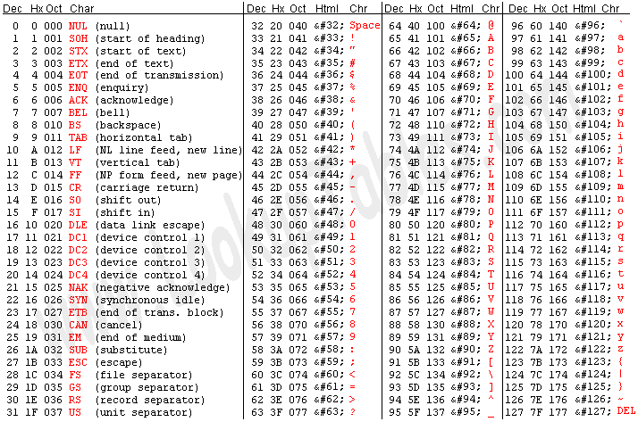

Trong chương này tôi sẽ nói về hệ điều hành, cách hệ điều hành tỉnh dậy và quán xuyến phần cứng máy tính để phục vụ bạn như thế nào. Sau đó tôi nói ngắn gọn về cách cái máy tính số hóa toàn bộ dữ liệu trên đĩa cứng để sau đó sử dụng khối lượng kiến thức đó để tính toán và đọc hiểu thế giới như thế nào. Sau khi ta hiểu cách cái máy tính lưu giữ thông tin trong bộ nhớ của hắn ra sao, tôi sẽ nói về ngôn ngữ lập trình, tức là ngôn ngữ dùng để giao tiếp với cái máy và yêu cầu nó làm điều ta muốn. Cuối cùng tôi mô tả sơ qua việc mạng internet vận hành như thế nào.

Source: [The Linux System Administrator's Guide](http://www.tldp.org/LDP/sag/html/index.html) & [The Unix and Internet Fundamentals HOWTO](http://en.tldp.org/HOWTO//Unix-and-Internet-Fundamentals-HOWTO/index.html)

<p class="note"> Lưu ý hệ điều hành Linux cũng có thể gọi là GNU/Linux. Phần này nếu các bạn muốn tìm hiểu có thể lên website cá nhân của Richard Stallman để đọc.

## Bộ não

Máy tính có phần cứng và phần mềm. Phần cứng là những thứ ta sờ nhìn thấy được, ví dụ như ổ cứng, màn hình, bàn phím, chuột. Phần mềm là những thứ vô hình chạy trên bộ xử lý ở trên bảng mạch, chúng nhận lệnh từ người dùng qua sự kiện bàn phím, chuột và xử lý đám lệnh rồi hiển thị kết quả trên màn hình cho ta thấy.

Nói vậy nghe cũng giống làm người. Ví dụ, bộ não sẽ thu nhận các tín hiệu từ môi trường qua các bộ dò \(tay chạm, mắt nhận photon ánh sáng, tai thu sóng âm..\) sau đó các dữ liệu này được truyền về não bằng tín hiệu điện \(qua hệ thống dây dẫn thần kinh\), các nhóm nơ-ron ở não và dọc xương sống sẽ xử lý các thông tin này và đưa ra hành động biểu hiện ra người khác thấy được \(ví dụ cảm xúc, lời nói, hành động..\)


[*Hình: Chip xử lý*](https://www.laptopmag.com/images/wp/purch-api/incontent/2016/12/shutterstock_437211229-670x377.jpg)


Cụ thể hơn, con chip xử lý sẽ là phần tính toán mọi thứ. Con chip này có bộ nhớ trong (gọi là RAM hoặc *core*). *Core* không phải là lõi (*kernel*), để tránh nhầm lẫn, tôi gọi là RAM. Bộ xử lý và bộ nhớ trong (RAM) sống ký sinh trên bảng mạch chủ (*motherboard* - phần cứng quan trọng nhất của máy tính). Một số phần cứng như màn hình, ổ cứng.. được chạy bằng thẻ điều khiển (*controller cards*) cắm trên bảng mạch chủ và đám này giúp máy tính lèo lái đám phần cứng lâu la kia. Kể cả những đám không có thẻ điều khiển thật thì cũng có chip bé trên bảng mạch chủ vận hành với cơ chế tương tự. Bàn phím do khá đơn giản nên hắn không cần có thẻ riêng, phần điều khiển được gắn thẳng vào bàn phím.


[*Hình: Bảng mạch chủ*](https://usercontent1.hubstatic.com/6328700_f520.jpg)


Tất cả các phần cứng bên trong *case* máy tính được kết nối vào máy qua cổng *bus*. Về mặt vật lý, cổng *bus* là khe cắm thẻ điều khiển (thẻ video, điều khiển đĩa, thẻ âm thanh..). Cổng *bus* sẽ kết nối chip xử lý với màn hình, đĩa và tất cả mọi thứ khác. Bộ xử lý mặc dù là thứ quản lý tất cả các thứ khác, thực ra không nhìn thấy những thứ đó, hắn nói chuyện với các phần kia qua cổng *bus* . Thứ duy nhất hắn được truy cập thẳng tay là bộ nhớ trong (*core* hay RAM). Vì thế phần mềm/chương trình nào muốn chạy thì phải ở trong bộ nhớ này.


[*Hình: cây máy*](https://www.quietpc.com/images/products/acousticase-c6607-3-large.jpg)


[*Hình: cổng bus (khe cắm thẻ)*](https://usercontent1.hubstatic.com/13171600_f520.jpg)


[*Hình: Đĩa cứng*](https://cdn.mos.cms.futurecdn.net/49e311834574eddba8bc6cb5fa6298fa-1200-80.jpg)

Khi máy tính đọc dữ liệu trên đĩa, có nghĩa là bộ xử lý gửi yêu cầu đọc qua cổng bus đến bộ điều khiển đĩa. Bộ điều khiển đĩa, với chuyên môn của hắn, sẽ điều khiển đầu đọc, xoay đĩa các kiểu để đọc dữ liệu nhị phân từ hóa (ví dụ chỗ nào mà từ trường bị méo thì đọc là 1, chỗ nào bình thường đọc là 0 chả hạn), sau đó lưu dữ liệu vào một vị trí nào đó trong bộ nhớ. Sau đó bộ điều khiển đĩa gửi tin trở lại cho bộ xử lý về địa chỉ của đám dữ liệu. Bộ xử lý, trên cơ sở đó, lại dùng cổng *bus* để đọc đám dữ liệu.

## Hệ điều hành

Nếu ta hình dung trong không gian, mỗi chương trình trên máy là một điểm sáng, thì cả hệ thống tư duy của cái máy tính là một mớ rối phức tạp và đẹp đẽ. Hệ thống nơ-ron và các mối liên kết của nơ-ron trong não cũng như vậy. Khi ta ấn nút bật máy tính, hệ điều hành (*operating system* - một chương trình đặc biệt) sẽ tỉnh dậy đầu tiên. Việc của hệ điều hành là giúp đỡ các chương trình khác chạy mượt hơn bằng cách xử lý đám rách việc phần cứng. Quá trình gọi hệ điều hành dậy gọi là kéo dậy (*booting* - nắm tóc tự kéo mình dậy). Máy tính của bạn biết cách kéo dậy (*boot*) bởi vì cách boot được viết sẵn vào chip BIOS (*basic input/output system*) của hắn. Chip BIOS trỏ đến một vị trí cố định trên ổ cứng, thường là đặc khu đầu tiên (được đánh số bé nhất), máy tính nghe theo chỉ dẫn tìm đến đó sẽ thấy một chương trình đặc biệt gọi là người tải chương trình kéo dậy (*boot loader* - tên là Grub hoặc LILO). Người tải chương trình kéo dậy sẽ được lôi vào bộ nhớ và bắt đầu chạy. Việc của hắn là gọi hệ điều hành dậy. Đầu tiên hắn đi tìm lõi (*kernel*), tải lõi vào bộ nhớ và bắt lõi chạy. Nếu bạn bật máy và thấy chữ LILO trên màn hình và một đám chấm chấm sau đó, có nghĩa là máy đang tải lõi. Mỗi dấu chấm nghĩa là nó đã tải được thêm một khối code của lõi.

Có thể bạn sẽ tò mò hỏi tại sao BIOS không tải lõi trực tiếp, tại sao hắn phải chạy đi tìm người tải chương trình kéo dậy? Tại vì BIOS không thông minh lắm. BIOS được viết cho những máy tính cổ xưa và không có khả năng để tải lõi trực tiếp. 

### Lõi 

Sau đó lõi sẽ chạy lăng xăng đi tìm đám phần cứng còn lại. Hắn không tìm linh tinh, hắn tìm đến những cổng ra/vào (*I/O port*) với những địa chỉ đặc biệt mà hắn biết là dễ có khả năng đó là địa chỉ của một cổng *bus* với một thẻ điều khiển đang đợi sẵn nghe lệnh. Lõi không đi tìm linh tinh bởi vì hắn có rất nhiều thông tin được viết sẵn cho hắn từ trước, hắn biết chỗ nào dễ có khả năng được việc và hắn biết cách đám điều khiển đánh tín hiệu trở lại nếu họ có mặt ở đó đợi hắn. Quá trình này được gọi là tự động lọ mọ.

Tất cả những quá trình này in ra rất nhiều thông tin trên màn hình. Nhưng ngày nay thường Linux sẽ che các dữ liệu trôi chảy ra màn hình này đằng sau một tấm mành (ở Ubuntu tôi dùng là màu tím). Nếu tò mò bạn có thể vén mành bằng cách nhấn tổ hợp ```Ctrl-Shift-F1```, nếu được thì che mành lại bằng tổ hợp khác, tùy máy, ví dụ ```Ctrl-Shift``` ```F1,7,8,9```.


[*Hình: Màn hình chờ Ubuntu*](https://c2.staticflickr.com/2/1650/24347407485_832104c8eb_c.jpg)

Hầu hết dữ liệu in ra màn hình ở thời điểm bình minh này sẽ là thông tin về việc lõi tự động lọ mọ tìm các phần cứng trong máy của bạn qua các cổng ra vào, xem xét xem hắn có trong tay những gì và từ đó tìm cách hòa nhập với cấu hình máy tính của bạn, như một mảnh linh hồn nhập vào với bộ máy điện tử. Lõi Linux có cơ chế thực hiện quá trình hòa nhập này rất tốt, tốt hơn các Unix khác và tốt vượt trội hơn DOS hoặc Windows.

Lõi là trung tâm của hệ điều hành. Người ta hay nhầm tưởng rằng phần lõi này là hệ điều hành, nhưng không phải vậy. Một hệ điều hành chạy nhiều việc hơn lõi không rất nhiều. Hệ điều hành theo dõi các tập tin trên đĩa, khởi động chương trình và chạy chúng song song với nhau, chia bộ nhớ và nguồn lực cho các chương trình khác nhau, nhận và gửi các gói dữ liệu qua mạng, và hơn thế nữa. 

Phần lõi thực ra làm rất ít việc, nhưng phần lõi cung cấp công cụ mà tất cả các dịch vụ đều phải dùng. Bởi vì phần lõi đứng chắn giữa ổ cứng và các chương trình. Tức là chương trình nào (kể cả chương trình hệ thống hay chương trình của người dùng) muốn có tác động lên ổ cứng (ghi, đọc dữ liệu) đều phải nói chuyện với phần lõi, không được can thiệp trực tiếp lên phần cứng. Công cụ phần lõi cho người ta dùng gọi là *system calls* (công cụ hệ thống). 

Phần việc quan trọng nhất của lõi là quản lý bộ nhớ và các chương trình chạy song song. Quản lý bộ nhớ tức là chia phần diện tích bộ nhớ trên ổ cứng giữa các chương trình đang chạy, chia phần cho chính nó nữa, và một phần cho phần nhớ tạm (*buffer*). Quản lý chương trình tức là chạy các chương trình, và nghĩ cách cho chúng chạy lần lượt nhau (nói là song song nhưng thực ra là mỗi chương trình được hưởng một tí sau đó đóng băng đợi tiếp).

### init

Quá trình kéo dậy không dừng lại ở sau việc kéo lõi dậy, đó chỉ là phần đầu. Sau phần đầu đó, lõi chuyển giao quyền lực cho một chương trình đặc biệt khác là **init**, **init** sẽ làm các việc dọn dẹp trang hoàng nhà cửa khác, những việc hắn vẫn làm mỗi ngày. Việc đầu tiên là hắn đi kiểm tra xem ổ đĩa của bạn có sứt sát gì không. Tập tin hệ thống là bọn sang chảnh, dễ bị hỏng khi phần cứng tự dưng bị ngắt hoặc tự dưng mất điện, cho nên phải kiểm tra để có gì còn sửa trước khi cả lò phần mềm được gọi dậy. Sau đó cán bộ ```init``` đi thuê bọn *daemon*. Deamon là thể loại chương trình cò mồi chuyên đi giữa đám đông nghe ngóng, đợi có yêu cầu sau đó làm gì đó. Ví dụ deamon đợi gác ở cổng máy in, chờ người dùng gửi đến tập tin để in cho tao. Bởi vì có thể xảy ra trường hợp nhiều người dùng gửi đến cùng lúc thì hắn sẽ cho bà con xếp hàng giữ trật tự, không gây láo nháo ở cổng quán photocopy. Các cò mồi deamon khác bao gồm nghề đi đưa thư (thi thoảng khi bạn gửi thư điện tử, có mail của deamon báo lại là hắn không đưa được thư cho bạn đó), hoặc *server* (người phục vụ) nằm im lặng đằng sau đợi có việc làm. Nói chung như cảnh cu-li đợi việc ở cầu Giấy, Bưởi. 

Sau đó **init** sẽ gọi **getty** để cho người dùng được đăng nhập vào máy, và đợi có chương trình nào mà chương trình bố mẹ tự dưng sập, thì **init** sẽ nhận nuôi chương trình con đó. Trong hệ thống UNIX tất cả các chương trình đều phải thuộc vào một cây phả hệ duy nhất, cho nên tất cả các chương trình mồ côi đều được **init** nhận nuôi.

Khi ta tắt máy, sẽ lại là **init** tất tả đi tắt hết các chương trình vẫn còn láo nháo lắm mồm, mời đi ngủ (*unmount*) bọn tập tin hệ thống và dừng bộ xử lý lại, và tất cả các việc khác nữa. 

### getty

Bước tiếp theo là chuẩn bị cho người dùng vào máy. **init** gọi dậy một chương trình gọi là **getty** để theo dõi màn hình và bàn phím của bạn. Thường thì hắn gọi dậy các phiên bản y hệt của **getty** để cho bạn có vài điểm điều khiển (*console*), mỗi điểm này kết nối với bàn phím và màn hình ở những lúc khác nhau. Điểm điều khiển giống như một bàn làm việc ảo. Thường thì một trong số các điểm điều khiển đó sẽ để dành cho người phục vụ X (*X server*). Người phục vụ X là tên một chương trình deamon, hắn chạy việc để giúp đỡ bôi trơn quá trình giao tiếp mạng và các dịch vụ khác. Hắn ngồi ở một điểm điều khiển và kết nối với màn hình, bàn phím và chuột. Việc chính của hắn là chiếu ra hình ảnh màu pixel như bạn thấy trên màn hình. Khi người phục vụ X được gọi dậy, thường thì hắn được gọi dậy ở phần cuối của quá trình kéo dậy, hắn sẽ lấy quyền kiểm soát của phần cứng mà được bàn giao lại cho hắn trên bàn làm việc. Đó là thời điểm bạn thấy màn hình đăng nhập hiện lên trước mắt, cung cấp cho bạn bởi người phục vụ X.


[*Hình: Đăng nhập bằng giao diện hình ảnh*](https://www.tecmint.com/wp-content/uploads/2018/05/Ubuntu-Login-Screen.png)

Tất nhiên thay vì gõ vào giao diện màn hình mà người phục vụ X đưa cho bạn, bạn có thể đổi sang phương thức đăng nhập khác: ngồi trực tiếp vào một điểm điều khiển (bàn làm việc) và gõ vào cổng giao tiếp bằng các dòng lệnh. Có thể là một chuỗi phím ```Ctrl+Shift``` nào đó để chuyển đổi giữa các phương thức. 

Dù gì, phiên bản **getty** ở điểm điều khiển sẽ ghi nhận tên người dùng và chạy chương trình **login**, chương trình này sẽ chạy đi tìm mật khẩu nó lưu và mã hóa, thường ở /etc/paswd. Mật khẩu có thể được lưu ở /etc/shadow/paswd tức là tăng khả năng bảo mật lên. Mật khẩu khi được mã hóa thì rất dễ, nhưng để giải mã thì rất khó. Thế nên kể cả khi người ta thấy được đám mã hóa cũng rất khó để giải mã. Và khi bạn quên mật khẩu thì cũng nên nghĩ ra mật khẩu mới chứ cũng không lấy lại được. Nếu đăng nhập thành công, **login** cho gọi chương trình **shell** để bạn chạy lệnh. Hoặc nếu bạn đăng nhập bằng giao diện hình ảnh thì hình nền của bạn sẽ hiện ra, bạn chạy chương trình bằng cách nhấn chuột hoặc mở ra một cổng giao tiếp gián tiếp (*terminal emulator*) để chạy lệnh. Cổng giao tiếp này chạy như **shell**. Thường tôi đăng nhập bằng giao diện hình ảnh, sau đó mở cổng giao tiếp (*terminal*) để chạy lệnh. Thế dễ hơn cho người mới bắt đầu. Lưu ý rằng lõi (*kernel*) không hiểu tí gì về mấy cái trò đăng nhập này, đây toàn là các cán bộ hệ thống khác mà hắn thuê đang làm việc.


[*Hình: Cổng giao tiếp Terminal*](https://i.ytimg.com/vi/CGk6-89g6jg/maxresdefault.jpg)

### Các chương trình

Sau khi *boot* xong, bạn tưởng tượng cái máy tính của bạn như một vườn bách thú chứa các chương trình thuộc các kiểu trên đời. Tất cả đều nhốn nháo đợi có gì đó để làm. Tất cả đều đợi sự kiện (*event*) gì đó xảy ra. Khi tôi nói sự kiện, có nghĩa là sự kiện chuột, bàn phím hoặc màn hình chạm: ví dụ bạn nhấn một phím trên bàn phím, hoặc bạn di chuột, hoặc ấn chuột trái phải.. Hoặc nếu máy tính của bạn được kết nối vào mạng với máy khác, thì sự kiện có thể là một gói dữ liệu vừa được gửi đến qua mạng đó. 

Các chương trình có thể tạm chia làm 2 loại: chương trình hệ thống (có ưu tiên cao hơn) và chương trình cho người dùng. Ranh giới cũng không rõ ràng lắm và tùy phiên bản mà người ta đóng gói cho bạn những chương trình khác nhau. Bạn cũng có thể can thiệp tự do vào hệ thống và đóng gói những gì bạn thích. Các phiên bản khác nhau của Linux trong hệ sinh thái mã nguồn mở hiện nay đều có phần code bên trong (các thư mục gốc) chuẩn như nhau (vì thế ai cũng hiểu được), nhưng các phần mềm tua rua bên ngoài thì được lựa chọn khác nhau, tùy khẩu vị. 

Lõi cũng là một chương trình, nhưng là một chương trình đặc biệt, bởi vì nó quản lý khi nào các chương trình người dùng khác được chạy. Thường thì nó là chương trình duy nhất có thể truy cập trực tiếp vào phần cứng của máy tính. Các chương trình khác phải gửi yêu cầu đến lõi bảo rằng đơn vị của tôi muốn có được dữ liệu bàn phím (những phím nào đang được người dùng ấn xuống), hoặc đơn vị của tôi muốn in ra thông tin này trên màn hình của đồng chí, hoặc đọc và viết vào đĩa, nói chung là hầu hết các việc trừ việc tự nghịch bits trong bộ nhớ. Những yêu cầu dạng này gọi là yêu cầu hệ thống (*system calls*). Chính vì mọi thứ ra/vào đều qua lõi nên lõi quản lý các chương trình sao cho chúng không dẫm đạp cùi chỏ nhau. Rất ít các chương trình người dùng có kim bài miễn hỏi để vượt mặt lõi và nói trực tiếp với cổng ra/vào. Một trong số đó là người phục vụ X. 

Bạn có thể chạy chương trình bằng 2 cách: qua người phục vụ X, hoặc qua **shell**. Thường là cả hai, nếu bạn như tôi. Tức là đăng nhập vào bằng màn hình giao diện hình ảnh (cung cấp cho bạn bởi người dùng X). Y tiếp quản bàn làm việc và chương trình **shell** ở trên bàn làm việc đó. Bàn làm việc của hắn cũng nối với màn hình, chuột và bàn phím. Khi đó hắn đưa cho bạn một cái màn hình giao diện để đăng nhập. Thông tin đến hắn rồi đến **shell**. Khi màn hình nền của tôi mở ra, tôi gọi một chương trình trông giống như **shell** (nhưng không phải **shell**), gọi là một cổng giao tiếp (*terminal*) để gõ lệnh vào đó. 

### Shell 
**shell** là vỏ, bởi vì nó bọc lấy lõi. **shell** không phải là lõi. **shell** nói chuyện với lõi bằng công cụ hệ thống (*system calls*). Vì thế mà ta có thể làm nhiều loại **shell** khác nhau tùy khẩu vị. Thường thì **shell** đưa cho bạn một màn hình chờ với ký hiệu ```$```ở đầu để bạn gõ lệnh vào. Bạn sẽ gõ lệnh thật khi đọc sang chương 2.

**shell** là một chương trình người dùng bình thường, cũng không có gì đặc biệt. Hắn hóng bạn nhấn phím, đứng nghe (tất nhiên là qua lõi) cổng ra/vào của bàn phím. Khi lõi thấy bạn gõ vào, sau đó ```Enter```, hắn chuyển cả dòng đến **shell**, **shell** sẽ bắt đầu ghép vần chuỗi phím nhấn rời rạc đó và dịch sang lệnh. 

Đơn cử, bạn gõ vào lệnh ```ls``` rồi ```Enter``` để liệt kê hết các tập tin và thư mục trong thư mục bạn đang đứng. **shell** sẽ sử dụng các luật được viết sẵn cho hắn từ trước để hiểu ra rằng, ồ bạn muốn chạy lệnh trong tập tin ```/bin/ls```. Hắn liền gọi hệ thống (*system call*) để lõi nhấc máy và bảo lõi chạy **/bin/ls** như một chương trình con, đưa quyền truy nhập màn hình và bàn phím cho lõi. Sau đó **shell** đi ngủ, đợi ```ls``` chạy xong.  Khi **/bin/ls** chạy xong, ```ls``` bảo lõi là con xong rồi bằng cách gọi hệ thống bảo thoát (*exit system call*). Lõi liền đi gọi **shell** dậy và bảo rằng mày chạy tiếp đi. **shell** hiện ra một dòng chờ lệnh mới (bắt đầu bằng ```$```) và đợi bạn gõ tiếp vào. Khi **/bin/ls** chạy bạn có thể làm việc khác như ghi nhận email.

Đoạn tôi vừa mô tả là khi bạn chạy thẳng lệnh vào **shell**, nếu bạn chạy chương trình qua người phục vụ X bằng các dịch vụ hắn cung cấp (ví dụ ấn chuột vào biểu tượng trên màn hình..), thì cơ chế của hắn cũng tương tự như trên. Có điều người phục vụ X không đi ngủ khi các chương trình khách đang chạy, hắn ngồi đợi giữa bạn và chương trình khách đó (ví dụ **/bin/ls**), chuyển tiếp tọa độ nhấn chuột, phím bạn nhấn và gửi yêu cầu bật pixel này pixel khác lên màn hình.

### Syslog 
Lõi và các chương trình hệ thống sẽ sinh ra lỗi, cảnh báo, và các tin nhắn khác. Những mảnh thông tin này cần được ghi lại vào một tập tin để sau này có khi cần xem. **syslog** sẽ là nhân vật làm công việc này. Các mảnh tin rơi ra từ lõi thường có ưu tiên cao hơn và được ghi vào tập tin riêng. Do thông tin về lõi cần được kiểm tra thường xuyên để xem có vấn đề gì không.

### cron và at 

Hai chương trình này chạy đi chạy lại để lau chùi dọn dẹp. Vì không phải chương trình nào cũng thu dọn tử tế sau khi xong việc. Và các tập tin cũ hoặc tạm nếu không dọn sẽ đầy ứ lên.

### Thiết bị đầu vào

Bàn phím của bạn là một thiết bị đầu vào đơn giản, bởi vì nó đưa vào dữ liệu rất chậm (so với chuẩn máy tính). Khi bạn nhấn hoặc thả một phím, sự kiện đó được gửi đến cáp bàn phím để loan báo đi rằng phần cứng vừa can thiệp. Nhiệm vụ của hệ điều hành là theo dõi những sự can thiệp kiểu này. Mỗi kiểu can thiệp có một người đứng ra thu nhận sự can thiệp. Như kiểu nhận đơn khiếu nại và đọc nội dung đơn sau đó cất tủ đợi xử lý. Ví dụ, người thu nhận sẽ ghi nhận những phím nào được nhấn và để vào chỗ gần cuối bộ nhớ. Hắn để đó và hệ điều hành sẽ chuyển quyền điều khiển cho chương trình nào đang hóng đọc dữ liệu vào từ bàn phím. 
Các thiết bị đầu vào phức tạp hơn như điã hay thẻ mạng cũng làm việc tương tự. Ví dụ bộ điều khiển đĩa nhận được tin từ lõi nói rằng "cần dữ liệu lưu ở khu số 3, từ địa chỉ này đến địa chỉ này". Hắn sẽ xuống thăm thôn dã và đọc dữ liệu. Sau khi đọc xong hắn bắn tin lại rằng yêu cầu của bạn đã được làm xong. Về mặt kỹ thuật, bộ điều khiển đĩa gửi đơn can thiệp / đơn khiếu nại. Người chuyên thu nhận khiếu nại từ đĩa sẽ sao chép dữ liệu vừa được đọc vào bộ nhớ, để phần mềm nào đòi đám dữ liệu đó vào đó mà đọc.

Khiếu nại nào cũng đi kèm mức độ ưu tiên. Khiếu nại từ bàn phím có ưu tiên thấp hơn khiếu nại từ đồng hồ hay sự kiện đĩa. Khiếu nại cũng cần phân loại đúng, để được đưa đến cho người thu nhận đúng. Nếu gửi nhầm người, hệ điều hành có thể sập. 

### Chạy song song?

Các chương trình không chạy song song, chúng xếp hàng đợi đến lượt. Mỗi đứa được chạy một tí sau đó đóng băng đợi đến lượt. Chả qua là bọn chúng làm việc đó quá nhanh ta tưởng rằng chúng đang chạy song song. Việc quản lý này là việc của lõi. Lõi có một phần gọi là người lên lịch. Y nắm giữ thông tin về mọi chương trình khác trong vườn thú của bạn (trừ lõi). Cứ 1/60s thì đồng hồ điểm trong lõi, gửi khiếu nại đồng hồ, khi đó người lên lịch dừng ngay chương trình đang chạy lại tại chỗ, chuyển quyền cho chương trình tiếp theo. 

1/60s nghe thì ngắn nhưng bộ vi xử lý có thể chạy hàng chục ngàn hướng dẫn cho máy tính trong khoảng thời gian ngắn ngủi đó. Linux xử lý đa nhiệm vụ rất tốt, hơn hẳn Windows hoặc MAC ngày xưa.

Ngoài việc phân bổ thời gian, người lên lịch cũng phân bổ không gian bộ nhớ để các chương trình không dẫm chân lên nhau khi chen chúc trong bộ nhớ làm việc. Kể cả nếu bọn nó không ghét nhau, bạn không muốn lỗi ở trong chương trình này phá hoại chương trình khác. Vì thế cần phải quản lý bộ nhớ. Mỗi chương trình trong sở thú cần một khu bộ nhớ riêng, để chạy code và giữ biến và kết quả. Tập hợp này bao gồm một khu chứa code (chỉ có quyền đọc) chứa hướng dẫn cho máy tính, và một khu chứa dữ liệu (có quyền viết) để lưu biến và kết quả. Khu dữ liệu bắt buộc phải riêng rẽ, nhưng nếu hai chương trình chạy cùng một đoạn code thì khu chứa code có thể được chia nhau. 

### Bộ nhớ ảo
RAM - giống như bộ nhớ ở phần cầu não trước trán, kích cỡ bé nhưng xử lý nhanh và dùng để tư duy tỉnh táo, xử lý các vấn đề xảy đến, và để hoạt động bình thường. RAM bé quá nên ta nghĩ cách dùng bộ nhớ ảo. Tức là khi có một phần việc ở RAM mà chưa cần ngay, lõi sẽ bê phần thông tin đó để vào ổ cứng, để cho phần bộ nhớ ở RAM trống đi dùng vào việc khác có ích. Tiền không thể để đắp chiếu. Phần bộ nhớ ảo ở ổ cứng mà chuyên để trữ thông tin chưa cần đến đó gọi là không gian để hoán đổi (*swap space*). Tất nhiên ghi đọc ở ổ cứng thì chậm hơn ở RAM nhiều lần. Nói tiền không để đắp chiếu là thật, RAM đắt hơn. Khi cài Ubuntu mà tự cài sẽ có phần phải chọn chia ổ cứng như nào, chia *swap space* nhiều nhiều chút.

Nói cụ thể hơn, có 5 loại bộ nhớ: 
* bộ đăng ký (*registers*) trên chip xử lý, 
* bộ nhớ trên chip, 
* bộ nhớ ngoài chip, 
* bộ nhớ chính (RAM / core), 
* và đĩa. 

Có nhiều loại ở trên thang bộ nhớ như vậy là vì tốc độ tăng thì tiền tăng. Bộ đăng ký trên chip xử lý là nhanh nhất và đắt nhất, có thể được truy nhập ngẫu nhiên một tỉ lần trong một giây. Bộ nhớ trên đĩa là chậm nhất và rẻ nhất, bạn chỉ có thể truy nhập ngẫu nhiên 100 lần một giây. Tốc độ và chi phí giữ hình hài của thang bộ nhớ gồm 5 bậc như vậy, ít khi đổi. Không ai làm máy tính với bộ nhớ nhanh nhất, vì quá đắt. Hơn nữa, bộ nhớ nhanh không giữ được dữ liệu khi điện tắt. Vì vậy máy tính phải có đĩa lưu dữ liệu. 3 loại bộ nhớ còn lại nằm giữa hai cực (cực nhanh và cực chậm) như là cầu nối.

Gọi là bộ nhớ ảo bởi vì trong thực tế bộ nhớ chính (số 4 trên thang bộ nhớ) không nhiều như ta đôi khi muốn, vì vậy cái máy chuyển từng khối dữ liệu (trang) nhảy cóc từ bậc 4 sang bậc 5 (và để vào khu vực hoán đổi trên đĩa), khiến cho cái máy tính tưởng rằng nó có nhiều bộ nhớ hoạt động hơn là nó có thật. Bộ nhớ ảo nhanh hay chậm là do khả năng (thuật toán) chuyển đổi các khối dữ liệu giữa các bậc thang hiệu quả như thế nào. Thường thì khá tốt. Những dữ liệu được đọc và viết gần thời gian nhau thì được xếp ở gần nhau trong không gian. Hệ thống bộ nhớ ảo nhặt từng khối dữ liệu trên đĩa vào khu làm việc theo ý hắn, khi khu làm việc đầy, hắn thả ra khối nào lâu không được động tới nhất. Đây được coi là thuật toán hiệu quả nhất. Sự chuyển đổi các khối dữ liệu giữa các bậc thang đều dựa trên cơ chế tương tự như trên. Ví dụ, bộ nhớ lưu tạm ngoài chip (*external cache*) ở bậc số 3 thì nhanh hơn bộ nhớ chính nhưng bé hơn. Khi chuyển các khối dữ liệu, vì lý do lịch sử, họ gọi các khối dữ liệu này là dòng thay vì trang như ở trên. Ở bậc số 2, bộ nhớ trong chip (*internal cache*) sống ngay trên chip. 

Tôi lấy thêm ví dụ, khi người dùng sử dụng một chương trình như kiểm tra thư điện tử, sẽ có những hành động mà hệ thống phải lặp đi lặp lại nhiều lần, để tránh lãng phí, hệ thống lưu tạm những thứ sẽ cần đến vào một khu gọi là bộ nhớ lưu tạm (*buffer cache*). Linux quản lý khoản này rất tốt. Ít dùng đến thì để xa, và xả đi sớm lấy chỗ. Lưu ý không tự ý tắt máy hoặc rút usb bất thình lình. Một số tập tin đang bị xử lý dở sẽ bị hỏng. Nếu hỏng tập tin hệ thống thì hơi khó. Nói chung, chương trình của bạn sẽ chạy nhanh hơn khi chúng đọc và xử lý dữ liệu gần nhau trong không gian và thời gian, bởi vì khi đó bạn cache tốt hơn (di chuyển các khối dữ liệu giữa các bậc thang nhanh hơn). Đơn giản hơn nữa, chương trình bé hơn thì sẽ nhanh hơn. Nếu chương trình của bạn không bị phụ thuộc vào tốc độ đọc dữ liệu của cổng ra/vào trên đĩa, hay không phải đợi sự kiện qua mạng, thì thường nó sẽ chạy ở tốc độ của bộ nhớ cache bé nhất mà nó nằm gọn trong. 

### Quản lý bộ nhớ 

Kể cả khi không cần chuyển các khối dữ liệu giữa các bậc thang, thì người quản lý bộ nhớ trong hệ điều hành vẫn có việc để làm. Hắn phải đảm bảo rằng các chương trình chỉ nghịch dữ liệu ở trong khu đất họ được chia mà thôi. Tức là ngăn code đểu của một chương trình xổ lồng chạy rông dày xéo lên ruộng nhà hàng xóm. Để làm việc đó, hắn lưu một bảng liệt kê các khu code và khu dữ liệu. Mỗi lần chương trình nào đòi thêm bộ nhớ hay trả tự do một khu đất (thường vào lúc chương trình đó thoát), hắn lại cập nhật danh sách đó. Danh sách này gửi lệnh đến một tổ đội đặc biệt gọi là tổ đội tự quản bộ nhớ. Bộ xử lý chip hiện đại có các tổ đội này được viết sẵn. Các tổ đội này có khả năng làm rào chắn quanh các khu bộ nhớ, vì thế khi code của bạn đòi truy nhập dữ liệu ngoài khu trại, bạn sẽ bị từ chối và lệnh đặc biệt được phát ra.

Nếu bạn lập trình C, bạn sẽ bị "segfault" ám ảnh như tôi. Tức là segmentation fault hoặc core dumped. Đây chính trường hợp có một chương trình đòi truy nhập bộ nhớ ngoài khu trại hắn được phân cho. Khi đó chương trình sẽ bị cắt đột ngột tại chỗ. Thường là lỗi trong code. Khi đó dữ liệu sau lỗi cần phải được đọc để tìm lỗi ở chỗ nào. Để phân lập các chương trình, ngoài việc chia địa bàn hoạt động cho chúng, bạn cũng có thể hạn chế quyền truy nhập các tập tin. Các tập tin quan trọng của hệ thống sẽ bị hạn chế truy nhập (ví dụ chỉ được xem nếu là người dùng bình thường..)

## Đĩa cứng


[*Hình: Đĩa cứng*](https://cdn.mos.cms.futurecdn.net/49e311834574eddba8bc6cb5fa6298fa-1200-80.jpg)

Bề mặt đĩa cứng được phủ chất liệu từ, để lưu dữ liệu (chỗ nào từ trường khác thường là giá trị 1, bình thường là giá trị 0). Bề mặt đĩa được chia thành các vòng đồng tâm (*track*), các vòng này được cắt ra thành các khu (*sector*). Những vòng ở ngoài có nhiều diện tích hơn nên sẽ có nhiều khu hơn. Mỗi khu (khối đĩa) có cùng kích cỡ (1024 bytes, 1 byte = 8 bits). Mỗi khối đĩa có một địa chỉ duy nhất (số của khối). Linux chia đĩa thành các phần (*partition*). Mỗi phần là một chuỗi các khối (khu) đĩa riêng biệt nhau. Một phần có thể là tập tin hệ thống. Phần khác là không gian hoán đổi cho bộ nhớ ảo. Chia các phần là để trị. Phần đánh số bé nhất thường để dành làm đặc khu để lưu các chương trình *boot*, ta đặt lõi vào đó để khởi động.

Đĩa có đầu đọc ghi. Đĩa quay và đầu đọc/ghi này di chuyển để tiếp cận được toàn bộ bề mặt. Bộ xử lý (CPU) sẽ nói chuyện với đĩa qua một phần mềm trung gian xử lý đĩa (bộ điều khiển đĩa - như đã nói ở trên). Tức là khi bộ xử lý muốn làm gì đó, nó phát ra lệnh: Tớ muốn lấy cái này. Trung gian này sẽ nói chuyện với đĩa là trao đổi lại sau. Làm thế này thì bộ xử lý (đầu não) không cần phải nghĩ cách bắn từng electron một để tạo đủ tín hiệu điện để di chuyển đầu đọc đến một tọa độ nhất định trên bề mặt đĩa để đọc xem tín hiệu từ ở đó là bật hay tắt (0 hay 1). Đó là việc của cán bộ địa phương: bộ điều khiển đĩa. Tôi sẽ nói về việc thông tin được ghi lại bằng nhị phân bật tắt ra sao ở phần sau. Dữ liệu của một tập tin thường được ghi gần nhau để tiện đọc. Thi thoảng tập tin bị chia nhỏ trên các khu khác nhau, thế này gọi là bị phân mảnh (Các bác Microsoft Windows đã chạy phần mềm chống phân mảnh hôm nay chưa?). 

Khi phần đĩa để đựng tập tin, ta cần có cơ chế để chiếu tên tập tin sang chuỗi khối đĩa chứa dữ liệu tương ứng. Bởi vì tập tin tiến hóa liên tục, nhiều khi một tập tin nằm rải rác ở các chỗ khác nhau nên địa chỉ dữ liệu của tập tin thay đổi liên tục. Trên cây *i-node*, mỗi nốt sẽ chứa địa chỉ dữ liệu của một tập tin. Mỗi nốt này lại được đánh số. Số *i-node* này không phải là tên của tập tin như người dùng nhìn thấy. Tên tập tin được sắp xếp trong một cây thư mục tương ứng cây *i-node*. Mỗi tên tập tin sẽ được nối sang một nốt *i-node*. Một tập tin có thể có nhiều tên (link cứng), chúng chỉ là các nốt khác nhau trên cây thư mục, tuy nhiên những nốt này chỉ đến cùng một điểm trên cây *i-node*. 


*[Hình](https://www.doc.ic.ac.uk/csg-old/graphics/unix-tree.gif): Cây thư mục hệ thống của Linux, cây này chỉ chứa tên. Ta dùng tên này để đối chiếu sang cây i-node. Các nốt ở cây i-node sẽ chứa địa chỉ để đi đến vùng dữ liệu trên đĩa cứng của từng tập tin. Ví dụ mời cán bộ thực địa đi tìm nhà anh chí, xóm bãi, thôn mới lập, khu số 3 trên đĩa cứng.*

Khi bạn khởi động, phần đĩa gốc (*root*) được khởi động đầu tiên, các phần khác sẽ được gọi dậy khi đến lúc, và buộc (*mount*) lần lượt vào dưới phần đĩa root. Lấy ví dụ, khi bạn mở tập tin có địa chỉ trong cây thư mục là /home/esr/www.xml thì lõi sẽ bắt đầu ở vị trí gốc (trong phần đĩa gốc), ở điểm đó, nó tìm thư mục tên là home, sau đó nó tìm tiếp esr và lấy số i-node của nốt đó. Khi đi đến i-node đó, nó thấy i-node của tập tin www.xml. I-node của tập tin đó lưu giữ danh sách các khối đĩa chứa dữ liệu của tập tin. 

Để tránh việc các chương trình truy nhập dữ liệu ngoài vùng làm việc, các tập tin có chế độ cho phép khác nhau. Mỗi tập tin có chế độ cho phép đọc (r - read), viết (w - write), và chạy (x - execute). Mỗi tập tin lại có 3 tập hợp cấp phép: một cho người dùng riêng lẻ, hai cho cả nhóm và ba cho tất cả mọi người. 

Ví dụ thư mục aaa có chế độ cấp phép như sau: drwxr--r--, ta đọc từ trái sang, 

* chữ d ở đầu nghĩa là đây là thư mục (d - directory), 
* 3 chữ cái tiếp theo thể hiện quyền cho người dùng riêng lẻ mà sở hữu tập tin đó: rwx - chủ tập tin được đọc viết và chạy, 
* 3 chữ cái tiếp theo thể hiện quyền cho nhóm sở hữu tập đó: r--, tức là ai ở nhóm sở hữu tập tin đó thì được đọc thôi không được viết không được chạy, 
* 3 chữ cái cuối dành cho tất cả mọi người, r-- nghĩa là ai cũng được đọc không thôi.

### Các thư mục hệ thống 
Linux có nhiều phiên bản khác nhau tùy khẩu vị người dùng, tuy nhiên ở tầm căn bản chúng đều tổ chức theo chuẩn. Ví dụ máy nào cũng có mấy thư mục gốc root, var, dev, usr, bin..

### Mã hóa thông tin

Source: [Chap 7: Computer memory](http://statmath.wu.ac.at/courses/data-analysis/itdtHTML/node55.html)

#### Bit, byte và word
Đơn vị căn bản nhất của bộ nhớ máy tính là bit (*BInary digiT*). Về mặt lý thuyết, bit là một giá trị nhị phân, tức là bật-tắt, sáng-tối, đen-trắng, 0-1. Tại sao lại có hai phía như thế? Tại vì nếu chỉ có 1 thì không có gì hay ho, nếu là 3 thì quá phức tạp, hai là vừa đủ. Bởi vì 1 bit như công tắc đèn, có hai giá trị: bật và tắt cho nên 1 bit có thể được thực hiện (implemented) bằng một vết từ nhỏ trên ổ cứng, một vết xước bé trên bề mặt phản quang của đĩa CD, hoặc ở trong usb thì là một cái transistor nhỏ. Khi máy dò của đầu dvd quét qua bề mặt phản quang của đĩa CD, nếu không có ánh sáng phản chiếu lại thì tức là đó là số 1, còn có ánh sáng phản chiếu lại tức là không có vết xước, máy dò đọc là số 0.

Máy dò có thể đọc được một chuỗi 010101 như thế này là ví dụ: đây chính là thông tin được mã hóa

```
00100101 01010000 01000100 01000110 00101101 00110001
00101110 00110100 00001010 00110101 00100000 00110000
00100000 01101111 01100010 01101010 00001010 00111100
00111100 00100000 00101111 01010011 00100000 00101111
01000111 01101111 01010100 01101111 00100000 00101111
01000100 00100000
```

Tất cả thông tin đều được mã hóa thành 01 hết. Tôi sẽ nói tiếp làm sao để hiểu được đống nhị phân này. 8 bit đặt cạnh nhau, ví dụ ```0001 1110``` gọi là 1 byte. 4 byte (32 bit): ```00011111  11110000 01010101 11110000``` gọi là 1 word. 

```
00100[1]000100[11111000]01010[10101000000111010001110101100010]111
    1 bit     --1 byte--     --------------1 word------------- 
```

Thường thì 1 chữ cái (ví dụ chữ a) chiếm 1 byte dữ liệu (8 bit, 8 giá trị nhị phân cạnh nhau dùng để lưu trữ 1 chữ cái, như nào tí nói). Đây *có thể* là một chữ cái ```01011010```. Để lưu trữ một số tự nhiên (âm và dương), máy tính dùng 4 byte (32 bit). Đây có thể là 1 số tự nhiên: ```01010101011010101010000111100011```.

Tôi nói cụ thể hơn, dây chữ "hello" có 5 chữ cái, sẽ chiếm 5 byte trong bộ nhớ, 1 byte lưu 1 chữ cái. Văn bản "12345" cũng là dây chữ, nên cũng chiếm 5 byte. Nhưng số tự nhiên (integer) 12345 sẽ chiếm 4 byte. Số 1 cũng chiếm 4 byte, số 123456789 cũng chiếm 4 byte.

Khi ta nói máy tính 32bit hay 64bit thì con số đó là kích cỡ của một cục thông tin chuẩn mà máy tính di chuyển qua lại. Về mặt kỹ thuật, đó là độ rộng của khu đăng ký trên bộ xử lý của máy tính (*register*), cũng là khu mà bộ xử lý dùng để làm tính và toán logic. 

#### Nhị phân, bát phân, 16 phân

<p class="tip"> Cách đổi số giữa các hệ phân (hệ thập phân sang hệ nhị phân, sang bát phân, 16 phân) các bạn có thể hỏi mạng. Rất dễ. Ở đây tôi chỉ nói cách lưu thông tin. 

Ví dụ chữ cái A theo chuẩn ASCII sẽ có mã là 65 (tôi nói về ASCII ở dưới). Số 65 này đổi ra số nhị phân sẽ là 1000001. Một chữ cái được chiếm 1 byte tức là 8 bit trong bộ nhớ. Chữ cái A mã hóa sẽ là ```01000001``` (ở đây 1 bit có thể mang giá trị 0 hoặc 1). Trong bộ nhớ thì là 8 chữ số nhị phân như vậy cho 8 bit, tức là 1 byte, tức là 1 chữ cái. Mắt ta nhìn như thế là quá nhiều. Thi thoảng người ta đổi sang hệ bát phân để có ít chữ số đi (lưu ý trên bộ nhớ máy tính vẫn là 8 chữ số nhị phân 0 1). Mã nhị phân cho chữ cái A chia ra thành ```01 000 001```, đổi sang bát phân sẽ là 101, thường họ thêm số 0 vào trước thành ```0101``` để nhấn mạnh rằng đây là hệ bát phân. Để viết ngắn hơn nữa, họ còn dùng hệ 16 phân. 1 byte 8 chữ số nhị phân được viết gọn lại thành 2 chữ số hệ 16 phân. Ví dụ chữ cái A chia ra thành ```0100 0001``` sang hệ 16 phân là 41, thường người ta viết là ```0x41``` hoặc ```#41```. Khi in bộ nhớ ra màn hình, thường sẽ in ra như sau, thành 3 cột:

```
0  :  6a 75 73 74 20 74 65 73 74 69 6e 67  |  just testing
```
Cột đầu tiên, số 0 gọi là offset, chỉ ra số thứ tự của byte đầu dòng ở trong tập tin. Cột ở giữa, chính là nội dung bộ nhớ, nhưng đổi về hệ 16 phân cho gọn. Cột cuối cùng, chinh là sự đọc hiểu (interpret) của bộ nhớ này. Ở trong ví dụ này, bộ nhớ lưu lại dòng văn bản "just testing" và những số 16 phân kia là chỉ từng chữ cái một thật. Ví dụ chữ j là 6a, chữ u là 75, chữ s là 73 ....

#### Số được lưu trữ như nào?

1 bit chỉ có hai giá trị 0 và 1. Nếu ta dùng 1 bit để lưu số, ta chỉ lưu được 2 số, 1 số đính vào trạng thái tắt của bit và một số nữa đính vào trạng thái bật của bit. Nghe thì đơn giản, nhưng chỉ cần vậy cũng lưu được khá nhiều thông tin. Ví dụ mã moorse, SOS signal, đều là chỉ dùng tín hiệu bật tắt. Tại sao? Vì họ dùng nhiều hơn 1 bit. Thường thông tin phát đi là một chuỗi dài. Tín hiệu khói của các bộ lạc ngày xưa truyền được những câu rất phức tạp: ví dụ có con chim sắt rơi ở trên bờ biển bọn mày êi, mau ra hôi của.

Nếu ta dùng 2 bit cạnh nhau, có thể biểu hiện 4 trạng thái: 00 01 10 và 11. Ta sẽ lưu được 4 số khác nhau. 4 số vẫn ít. Nhìn chung, nếu ta dùng k bits, mỗi bit có 2 trạng thái khả dĩ, ta dùng toán tổ hợp sẽ tính ra được số trạng thái ta có thể biểu thị là 2 mũ k.

Trong thực tế, máy tính hay dùng 4 byte để lưu số (tức là 32 bit). Ta có thể lưu được số tự nhiên từ số 0 đến số 4,294,967,295 (2 mũ 32 trừ 1, tại sao?). dưới đây là số tự nhiên từ 1 đến 5 lưu trong bộ nhớ máy tính:

```
 0  :  00000001 00000000 00000000 00000000  |  1
 4  :  00000010 00000000 00000000 00000000  |  2
 8  :  00000011 00000000 00000000 00000000  |  3
12  :  00000100 00000000 00000000 00000000  |  4
16  :  00000101 00000000 00000000 00000000  |  5
```

Có hai vấn đề, thứ nhất là ta không lưu được số âm, thứ hai là số từ 2 mũ 32 trỏ đi ta cũng không lưu được. Để giải quyết vấn đề thứ nhất, ta sử dụng bit đầu tiên để diễn tả dấu âm dương. Thế là ta sẽ lưu được số từ -2,147,483,648 đến 2,147,483,647 (cộng trừ 2 mũ 31 trừ 1). Lưu như thế nào? Bằng hệ thống *two's complement* (hệ thống hoán đổi - tôi dịch tạm). Để hiểu được cách lưu số âm và dương, tôi tạm thời dùng 4 bit (1/2 byte) để lưu số:

- số 0 (thập phân) lưu thành 0000
- với các số dương, thì tăng dần lên từ 0000
- với các số âm, thì giảm dần từ 1111 (thế nên gọi là hoán đổi)

Với quy luật trên, 

* số không sẽ là 0000, 
* số một: 0001, 
* số hai: 0010, 
* số ba: 0011, 
* số bốn đến bẩy: 0100 đến 0111. 

Đến đây là kịch kim vì với 3 chữ số (3 slots) ta chỉ lưu được 2^3 - 1 = 7 (chữ số (slot) đầu tiên là để chỉ dấu). Với số âm, 
* ta có 1111 là âm một, 
* 1110: âm hai, 
* 1101: âm ba, 
* 1100 đên 1000: âm bốn đến âm tám. 

Lưu ý ta lưu được từ -8 cho đến 7, tại sao không phải từ -8 đến 8, vì 0000 là để lưu số 0, không âm không dương nên lệch vậy. Tôi lấy ví dụ một phép toán trong cách lưu trữ này:

* Số hai là 0010, số âm hai là 1110. 
* Khi ta cộng lại 0010 + 1110 = 10000. 
* Kết quả 10000 có 5 chữ số, trong khi ta chỉ có 4 bit, chữ số đầu tiên (chữ số 1) bị tràn (*overflow*), nên kết quả thực ra là 0000 tức là bằng không. 
* Hai (0010) cộng với âm hai (1110) bằng không (0000).

Số thực thì phức tạp hơn. Số thực được viết như trong khoa học: ví dụ 1.234 \* 10^23. Khi đó, ta mã hóa số này thành 2 phần: 1.234 (mantissa) và 23 (phần mũ). Số thực được lưu như số nổi (*floating point number*). Ví dụ, nếu ta dùng một word (32 bit) để lưu số thực, thì bit đầu là bit chứa dấu âm dương, 8 bit sau là lưu phần mũ, 23 bit còn lại lưu phần mantisssa. 

#### Số hóa thông tin 

Sau khi nghĩ xong cách lưu số trên máy tính rồi, ta nhận ra rằng nếu ta chuyển đổi tất cả chữ cái thành số hết, thì ta có thể lưu tất cả thông tin trên máy tính. Nói *số hóa* nghĩa là như vậy. Tất nhiên, tôi không loại trừ khả năng, trong vũ trụ này hoặc vũ trụ khác có những loại thông tin bất khả diễn đạt thành lời. Nhưng nói chung, chỉ tính riêng những loại có thể viết thành chữ (thành biểu tượng nói chung), và từ biểu tượng đó thành số sau đó lưu lại trên máy, thì cũng khá tốt rồi.

Ta đổi chữ cái sang số như thế nào? Khá là đơn giản, tất cả mọi người đồng ý với một chuẩn chuyển đổi, thế là xong. Chuẩn [ASCII](http://www.asciitable.com/):



Chuẩn ASCII không đủ lắm, to nhất hiện giờ là chuẩn Unicode, phiên bản phổ biến là UTF-8. Trong UTF thì các biểu tượng từ 0-127 là ASCII. Từ 128-255 là khác. Tại sao 255 là to nhất, vì thường chữ cái được lưu trong 1 byte (là 8 bit), mỗi bit có 2 trạng thái cho nên 8 bit sẽ lưu được 2^8 = 256 chữ cái. 255 là to nhất là do ta đếm từ số 0. Trong ngành máy tính người ta hay đếm từ số 0.

## Ngôn ngữ máy tính

Các bạn đã thấy là chương trình được chạy như thế nào. Mỗi chương trình đều phải chạy một chuỗi byte. Chuỗi byte này chính là nỗ lực giao tiếp với cái máy tính nhằm hướng dẫn nó làm nhiệm vụ mà mình bảo. Truyền thuyết kể rằng có những cao thủ giữa chúng ta đã luyện mắt thành thần và đọc được những chuỗi nhị phân này, thanh niên mua đĩa CD về dùng mắt thường quét ánh phản quang lại và đọc trực tiếp nhị phân trên những vòng lóng lánh của đĩa.

Ngôn ngữ máy tính nhị phân mà đổi sang bát phân thì dễ đọc hơn chút, hoặc tiến hóa thêm vài bước thì cũng dễ đọc hơn chút. Chúng giống như những lớp code mới (assembly) bọc mỏng quanh những chuỗi 0101 vô tận. Những ngôn ngữ này vẫn được gọi là ngôn ngữ tầm thấp (*low level*). Những ngôn ngữ tầm cao hơn là những ngôn ngữ gần với con người hơn, khiến cho người lập trình dễ đọc và dễ sử dụng, dễ múa kiếm sai khiến này nọ hơn. Những dòng code này sẽ đi qua nhiều lớp dịch để đi dần xuống loại ngôn ngữ mà máy tính hiểu được và thi hành.

#### Compiled languages: Ngôn ngữ soạn nhị phân 
Khi bạn viết xong code bằng những ngôn ngữ này, một chương trình gọi là người soạn sẽ dịch chúng sang ngôn ngữ máy tính. Sau khi đã được soạn sang vô tận nhị phân, bạn có thể chạy trực tiếp mà không cần hiểu cũng không cần nhìn lại code ban đầu. Mở các phần mềm ra thấy toàn một chuỗi nhị phân, không thấy code đâu cả. 

Ví dụ về ngôn ngữ kiểu này là C (C++), FORTRAN, COBOL. C là phổ biến nhất.

#### Interpreted languages: Ngôn ngữ diễn dịch 

Khi bạn viết xong code bằng những ngôn ngữ này, một chương trình gọi là người thông dịch sẽ dịch tại chỗ code thành các chu trình tính toán và cuộc gọi hệ thống. Bản code sẽ phải được dịch lại (cùng với sự có mặt của người thông dịch), mỗi lần ta chạy lại chương trình. 

Rất nhiều chương trình nhỏ của Unix, như shell, bc, sed, awk là ngôn ngữ diễn dịch rất hiệu quả. BASICS cũng là ngôn ngữ diễn dịch. LISP là ngôn ngữ diễn dịch thành công nhất. Ngày nay, shell của Unix và LISP mà sống trong phần mềm biên tập Emacs là một trong những ngôn ngữ diễn dịch quan trọng nhất.

#### Ngôn ngữ P-code 
Kể từ 1990, ngôn ngữ p-code là giải pháp ở giữa hai cực trên. Khi bạn viết xong code nguồn (*source code*), code đó sẽ được soạn sang một dạng nhị phân nén dùng để chạy. Nhưng dạng nén đó chưa phải là ngôn ngữ máy tính, chỉ là xuýt xoát ngôn ngữ máy tính thôi (p-code = pseudo code). Ngôn ngữ xuýt xoát đó đơn giản hơn nhưng mạnh hơn ngôn ngữ máy tính. Khi bạn chạy lại chương trình, người thông dịch sẽ diễn dịch p-code cho cái máy hiểu. 

P-code chạy nhanh gần như nhị phân được soạn sẵn (do người dịch của p-code rất dễ làm). Ví dụ nổi bật: Python, Perl, Java.

## Mạng internet

Tôi lấy ví dụ phổ biến đó là khi bạn chỉ phần mềm lướt mạng Firefox đến địa chỉ http://www.tldp.org/HOWTO/index.html. Tức là bảo hắn đi lấy tập tin index.html ở thư mục HOWTO trên máy chủ tên là www.tldp.org 


*[Hình](https://techlogitic.net/wp-content/uploads/2017/08/what-is-a-dns-server.png): Trình duyệt đi hỏi địa chỉ máy chủ ở tổng đài danh bạ sau đó tự đến địa chỉ đó để giao dịch với máy chủ*


* Việc đầu tiên trình duyệt cần làm là thiết lập một kết nối mạng đến cỗ máy mà văn bản trên được lưu:
	* Trước tiên hắn cần tìm địa chỉ mạng của máy chủ (*host*) tên là www.tldp.com. Địa chỉ này toàn số và gọi là địa chỉ IP.
	* Để làm được điều đó, hắn đi hỏi một chương trình tên là danh bạ (*name server*). Danh bạ sống trên một máy dịch vụ ở đâu đó trong không gian mạng sâu thẳm. Khi bạn đăng ký với một nhà mạng (ISP - internet service provider), quá trình cài đặt sẽ bao gồm bảo cho phần mềm internet trong máy của bạn địa chỉ IP của một danh bạ sống sẵn trên hệ thống của nhà mạng đó. 
	* Những danh bạ ở những máy khác nhau sẽ nói chuyện với nhau, trao đổi và giữ những thông tin cần thiết để giúp bạn quy đổi tên máy chủ sang địa chỉ IP. 
	* Danh bạ sẽ bảo trình duyệt (Firefox) của bạn biết rằng địa chỉ IP của www.tldp.org là 152.19.254.81. Sau khi biết điều này rồi, máy của bạn sẽ đến nói chuyện trực tiếp với máy www.tldp.org.
	  
Toàn bộ hệ thống các chương trình và cơ sở dữ liệu mà kết hợp với nhau để dịch tên máy chủ sang địa chỉ IP gọi là DNS - hệ thống tên miền (Domain Name System). Khi bạn nói đến máy DNS, hắn chính là danh bạ. 

Các bạn có thể thấy tên máy chủ được chia ra thành các phần bằng dấu chấm. Các phần đó là tên miền. Tên miền .org là một bộ sưu tập các máy có chung tên đuôi .org. Tên miền có thể sống trong tên miền khác. Ví dụ, máy www.tldp.org sống trong .tldp.org và .tldp.org là tên miền con của tên miền .org. Mỗi tên miền có một danh bạ đương quyền, người này có hết tên của các máy trong tên miền đó. Nếu người này sập sẽ có các máy phụ chứa dữ liệu sơ cua. Các máy phụ cập nhật liên tục, cách vài giờ. Mỗi danh bạ chỉ cần biết tên của các máy trực tiếp liên hệ với mình, và tên danh bạ đứng đầu các hệ khác. Ví dụ hắn biết tên con cái trực tiếp của hắn, nhưng không biết tên cháu chắt vì không cần thiết. Đám con cái có tên đám cháu chắt rồi, khi cần thì hỏi. 

Các tên miền trong hệ thống DNS giống như một cây thư mục, tất cả đều biết địa chỉ IP của danh bạ gốc (*root*), địa chỉ này có sẵn trong phần mềm DNS. Danh bạ gốc biết địa chỉ IP của những danh bạ cao cấp trực tiếp dưới quyền hắn ví dụ như .com và .org, nhưng không biết gì về tầng bên dưới họ. Mỗi danh bạ cao cấp đó lại biết tên máy ngay dưới nó, nhưng không sâu hơn. Thường thì, bọn danh bạ khá lười, hắn giữ lại các địa chỉ đã tìm ra trước đó, để lần sau cứ thế đến. Khi bạn vào website mới, sẽ hiện ra dòng "Looking up host.." nhưng chỉ lần đầu đó thôi. Tất nhiên sau một thời gian thì các địa chỉ lưu đó cần xóa đi để tìm mới lại, hoặc cũng bị xóa đi nếu hắn đến tìm mà không thấy nữa.

* Sau khi đã tìm thấy máy kia, trình duyệt gửi một lệnh đến chủ máy kia: ```GET /LDP/HOWTO/index.html HTTP/1.0```

	* Lệnh trên được đóng gói lại như gửi điện tín, gói dữ liệu này là một khối bit, ngoài phong bì có 3 thứ thông tin:
	  * Địa chỉ nguồn (Địa chỉ IP của máy bạn)
	  * Địa chỉ đến (152.19.254.81)
	  * Số dịch vụ / số cổng. Trong trường hợp này là số 80, ý là yêu cầu qua mạng thế giới (world wide web).
	* Máy tính của bạn đưa gói hàng đi đến máy phát mạng tại nhà của bạn, cho đến khi hắn gặp người chỉ lối (*router*). Người này có bản đồ của mạng internet trong trí nhớ của hắn - không hẳn là hắn biết hết, nhưng hắn biết bản đồ của thôn bạn, và hắn biết cách đi đến chỗ các trưởng thôn khác.  
	* Gói dữ liệu của bạn có thể đi qua tay vài người chỉ lối / trưởng thôn trước khi đến điểm đến. Người chỉ lối khá thông minh. Hắn ghi lại xem các trưởng thôn khác mất bao nhiêu thời gian để bắn tin lại rằng họ đã nhận được gói dữ liệu. Hắn dùng thông tin đó để gửi dữ liệu qua các đường nhanh nhất. Hắn gạch đi những trưởng thôn mất liên lạc và tính cách đi đường khác. Người ta đùa rằng mạng internet được thiết kế để sống sót sau nổ bom nguyên tử. Không hẳn vậy, nhưng quả tình là thiết kế của mạng internet giữ được chất lượng phục vụ ổn định trong một thế giới bất ổn toàn phần cứng cùi bắp. Điều này có được là nhờ sự thật rằng sự thông minh của mạng internet được phân bổ qua hàng ngàn điểm nốt (các trưởng thôn) thay vì tập trung lại ở một vài điểm cực lớn và dễ sập như mạng điện thoại. Khi đó, sự cố sẽ được thu nhỏ và cả hệ thống có thể đi vòng qua chúng. 
	* Khi gói dữ liệu đến tay máy kia, máy đó sẽ chuyển thư đến người phụ vụ web nhờ con số đính kèm. Như kiểu xếp hàng lấy số ở bệnh viện Bạch Mai. Người phục vụ web nhìn vào địa chỉ nguồn để biết đường hồi đáp. Khi người phục vụ web trả về trang web index.html, trang sẽ được bổ ra thành các gói nhỏ tùy trường hợp. 

Việc gửi đi lại này cần có quy trình. Quy trình IP (internet protocol) là quy trình dán nhãn đi và đến lên từng gói. Quy trình TCP (transmission control protocol) là quy trình quản lý đi và đến. Ví dụ khi hai máy gửi và nhận, người nhận phải gửi lại là tao đã nhận, nếu không người gửi đi sẽ gửi lại. Người gửi đi cũng gửi các thông tin khác, ví dụ đánh số các gói, tổng dữ liệu, vì khi ta gửi các dòng byte qua lại giữa một cặp máy, có thể xảy ra sự cố. Ngoài 2 quy trình trên còn có quy trình ứng dụng (application protocol). Tức là khi trình duyệt và người phục vụ mạng nói chuyện qua lại thì họ nói chuyện bằng dây chữ mà con người có thể hiểu được. Quy trình này gọi là HTTP (Hyper Text Transfer Protocol) và dòng lệnh GET ở trên là một ví dụ. Khi lệnh GET đó đến người phục vụ mạng của máy chủ www.tldp.org với số dịch vụ 80, sẽ có một deamon đợi sẵn ở cổng 80 để nghe lệnh. Những deamon mạng này (cu-li mạng :) không làm gì ngoài đợi ở cổng, đợi và thi hành cách lệnh đến. HTTP cũng như SMTP (*simple mail transfer protocol*, quy trình gửi thư điện tử), thường dùng các lệnh văn bản đơn giản dễ đọc, đánh đổi lại bằng việc tốc độ giảm đi tí chút. Vì thế, khi deamon gửi lại cho bạn thì hắn cũng viết bằng văn bản dễ đọc (không phải toàn số). Phần mở đầu của lá thư hồi đáp thường là thế này:

```
Firefox thương nhớ,

HTTP/1.1 200 OK 
Date: ngày buồn tháng nhớ năm thương 
Server: Apache .. Red Hat 
Last modified: .. 
Content Length: 2982
Content type: tex / html

```

Sau đó sẽ là một dòng trống và là toàn bộ nội dung trang web. Kết nối sau đó sẽ ngắt. Trình duyệt (người lướt mạng) của bạn sẽ hiển thị trang đó theo HTML bởi vì hắn đọc ở đầu thư và thấy rằng nội dung trang này là HTML. Sang chương sau bạn sẽ viết HTML thật sự.
